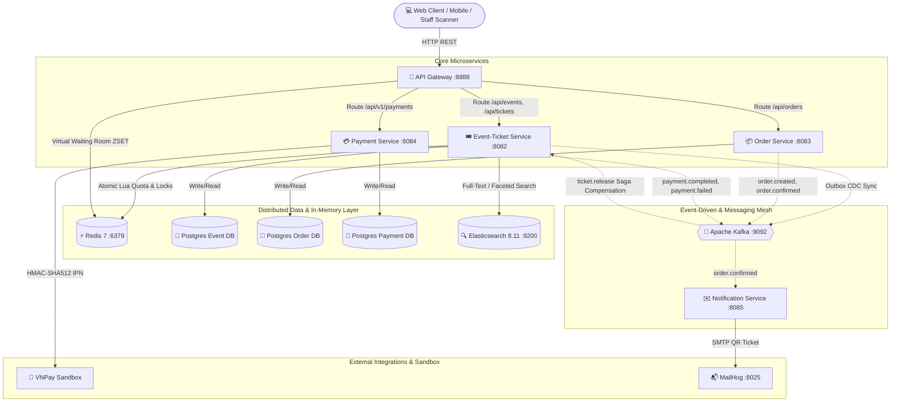

# ⚡ TICKETFLOW — HIGH-CONCURRENCY DISTRIBUTED TICKETING PLATFORM
> **Hệ thống phân tán đặt vé sự kiện & săn vé Flash Sale quy mô lớn với khả năng chịu tải cao, giải quyết triệt để bài toán Race Condition, Zero-Overselling và Đảm bảo tính nhất quán dữ liệu phân tán (Data Consistency).**

---

## 📑 BẢNG MỤC LỤC
1. [Tổng Quan Bài Toán & Giá Trị Hệ Thống](#-1-tổng-quan-bài-toán--giá-trị-hệ-thống)
2. [Kiến Trúc Tổng Thể (System Architecture)](#-2-kiến-trúc-tổng-thể-system-architecture)
3. [Nghiệp Vụ Cốt Lõi (Core Business Capabilities)](#-3-nghiệp-vụ-cốt-lõi-core-business-capabilities)
4. [Kỹ Thuật & Giải Pháp Công Nghệ Sử Dụng](#-4-kỹ-thuật--giải-pháp-công-nghệ-sử-dụng)
5. [Các Kịch Bản Demo Dành Cho Nhà Tuyển Dụng](#-5-các-kịch-bản-demo-dành-cho-nhà-tuyển-dụng)
6. [Hướng Dẫn Cài Đặt & Khởi Chạy Nhanh](#-6-hướng-dẫn-cài-đặt--khởi-chạy-nhanh)
7. [Bản Đồ Cổng Dịch Vụ (Service Registry & Ports)](#-7-bản-đồ-cổng-dịch-vụ-service-registry--ports)

---

## 🎯 1. TỔNG QUAN BÀI TOÁN & GIÁ TRỊ HỆ THỐNG

Trong các đợt mở bán vé đại nhạc hội hoặc sự kiện thể thao lớn (Concert, World Tour, Chung kết bóng đá), hệ thống phải đối mặt với các thách thức kỹ thuật phân tán cực kỳ phức tạp:
* **Lưu lượng truy cập tăng đột biến (Traffic Spike):** Hàng trăm ngàn người dùng cùng truy cập và nhấn "Mua vé" trong cùng một giây.
* **Nguy cơ bán lố (Overselling):** Nhiều luồng xử lý đồng thời dẫn đến tranh chấp kho dữ liệu (Race Condition).
* **Tranh chấp số ghế (Seat Conflict):** Nhiều khách hàng cùng click vào một vị trí ghế cụ thể trong cùng một mili-giây.
* **Giao dịch phân tán (Distributed Transactions):** Đơn hàng trải qua nhiều microservice (Đặt vé $\rightarrow$ Thanh toán $\rightarrow$ Xuất vé $\rightarrow$ Gửi email). Nếu thanh toán thất bại hoặc quá hạn 10 phút, hệ thống phải tự động bồi hoàn kho vé mà không làm rò rỉ tài nguyên.

**TicketFlow** được thiết kế và triển khai nhằm giải quyết trọn vẹn các bài toán trên bằng kiến trúc **Microservices hướng sự kiện (Event-Driven Architecture)**, kết hợp **Redis In-Memory Atomic Operations**, **Distributed Saga**, **Transactional Outbox** và **Elasticsearch**.

---

## 🏗️ 2. KIẾN TRÚC TỔNG THỂ (SYSTEM ARCHITECTURE)

Hệ thống được module hóa thành các microservices độc lập theo nguyên lý **Database-per-Service**, giao tiếp bất đồng bộ qua **Apache Kafka** và đồng bộ qua **API Gateway**.



### Danh Mục Các Service Trong Hệ Thống:
1. **API Gateway (`gateway:8888`):** Xây dựng trên Spring Cloud Gateway (Reactive WebFlux), chịu trách nhiệm định tuyến, kiểm soát truy cập, ngăn chặn IDOR và tích hợp **Phòng Chờ Ảo (Virtual Waiting Room)** bằng Redis ZSET.
2. **Event & Ticket Service (`event-ticket-service:8082`):** Quản trị sự kiện, quản lý kho vé nguyên tử (Atomic Lua script), đặt ghế theo sơ đồ (Seat Hold/Lock) và soát vé cửa vào (Staff Check-In).
3. **Order Service (`order-service:8083`):** Đóng vai trò điều phối giao dịch phân tán (Saga Orchestration), quản lý trạng thái đơn hàng và cung cấp báo cáo doanh thu tối ưu hóa bộ nhớ đệm (Cached Sales Report).
4. **Payment Service (`payment-service:8084`):** Tích hợp cổng thanh toán VNPay Sandbox, xác thực chữ ký số HMAC-SHA512 và xử lý callback IPN bất đồng bộ.
5. **Notification Service (`notification-service:8085`):** Tiêu thụ Kafka event, sinh mã QR vé điện tử kèm chữ ký bảo mật và gửi email cho khách hàng qua MailHog.
6. **Frontend UI & Benchmark Simulator (`frontend:3000`):** Giao diện người dùng tối giản (Minimalist UI), tích hợp **Live Telemetry Stream** và **Trung tâm giả lập các kịch bản stress-test phân tán**.

---

## 💼 3. NGHIỆP VỤ CỐT LÕI (CORE BUSINESS CAPABILITIES)

### 1. Cơ Chế Đặt Vé Kép (Dual-Model Ticketing Engine)
Hệ thống hỗ trợ linh hoạt 2 mô hình đặt vé phổ biến nhất hiện nay:
* **Model A — Chọn ghế cụ thể theo sơ đồ (Numbered Seats):**
  * Hiển thị ma trận ghế trực quan (Row A, B, C...).
  * Khi user chọn ghế, hệ thống cấp khóa phân tán trên Redis (`seat_lock:{eventId}:{seatId}`) với thời gian giữ chỗ **10 phút**.
  * Chống tranh chấp ghế tuyệt đối: Hai người cùng chọn một ghế trong cùng mili-giây thì chỉ duy nhất một người giữ được (`HOLD`), người còn lại nhận thông báo `409 Conflict`.
* **Model B — Vé đứng tự do / Flash Sale (Standing Zone Quota):**
  * Dành cho các khu vực Fanzone, GA không chia số ghế.
  * Tận dụng **Redis Lua Script** để kiểm tra tồn kho và trừ số lượng nguyên tử trong **< 2ms**, triệt tiêu hoàn toàn hiện tượng bán lố (Zero Overselling).

### 2. Phòng Chờ Ảo (Virtual Waiting Room)
* Khi sự kiện mở bán và lưu lượng vượt ngưỡng cho phép (ví dụ: > 100 req/s), Gateway tự động chuyển hướng người dùng vào hàng đợi trên Redis ZSET (`waiting_room:active_event`).
* Trả về HTTP `429 Too Many Requests` kèm số thứ tự xếp hàng và thời gian ước tính. Khi đến lượt, hệ thống tự động cấp `Queue-Pass-Token` (hiệu lực 5 phút) để người dùng tiến vào trang đặt vé.

### 3. Giao Dịch Phân Tán & Bồi Hoàn Tự Động (Distributed Saga & Compensation)
* Áp dụng mô hình **Saga Choreography kết hợp Transactional Outbox Pattern**:
  * **Trường hợp Thành Công:** Khách hàng thanh toán VNPay thành công $\rightarrow$ `payment.completed` $\rightarrow$ Order chuyển `CONFIRMED` $\rightarrow$ Ghế chuyển từ `HOLD` sang `BOOKED` vĩnh viễn $\rightarrow$ Notification gửi vé QR qua Email.
  * **Trường hợp Thất Bại / Hết Hạn 10 Phút:** Khách hàng hủy hoặc không thanh toán $\rightarrow$ Event `ticket.release` được kích hoạt $\rightarrow$ Hệ thống tự động bồi hoàn: nhả khóa ghế về `FREE` và hoàn kho vé đứng về Redis an toàn.

### 4. Soát Vé Sân Vận Động (Staff Check-In Engine)
* Vé gửi cho khách hàng chứa mã QR kèm chữ ký điện tử **HMAC-SHA256**.
* Thiết bị quét tại cổng vào có thể đối soát chữ ký offline mà không phụ thuộc hoàn toàn vào DB.
* Sử dụng Redis `SET NX` để chống gian lận quét vé hai lần (Anti-Fraud Double Scan) tại các cổng khác nhau.

### 5. Tìm Kiếm Sự Kiện Phân Tán (Elasticsearch Faceted Search)
* Toàn bộ sự kiện khi tạo mới được đồng bộ sang **Elasticsearch 8.11** thông qua Outbox CDC Sync.
* Hỗ trợ tìm kiếm mờ (Fuzzy text match), lọc đa chiều theo địa điểm, danh mục và khoảng giá với độ trễ cực thấp.

---

## 🛠️ 4. KỸ THUẬT & GIẢI PHÁP CÔNG NGHỆ SỬ DỤNG

| Khía Cạnh | Công Nghệ & Kỹ Thuật Áp Dụng | Mục Đích Kỹ Thuật |
|:---|:---|:---|
| **Core Framework** | Java 21, Spring Boot 3.3+, Spring Cloud Gateway | Nền tảng microservices hiện đại, tối ưu hiệu năng với Virtual Threads và Reactive WebFlux. |
| **Data In-Memory & Lock** | Redis 7, Lua Scripting, Redis ZSET | Trừ kho nguyên tử tốc độ cao (<2ms), khóa phân tán giữ ghế (TTL 10 phút), hàng đợi phòng chờ ảo. |
| **Message Broker** | Apache Kafka 3.7 (KRaft Mode) | Xương sống giao tiếp bất đồng bộ, truyền tải domain events giữa các microservices. |
| **Search Engine** | Elasticsearch 8.11, Spring Data Elasticsearch | Tìm kiếm mờ toàn văn (Fuzzy Search) và lọc sự kiện đa chiều (Faceted Filtering). |
| **Relational Database** | PostgreSQL 16 (Multi-Database Pattern) | Đảm bảo tính toàn vẹn dữ liệu ACID cho từng domain nghiệp vụ riêng biệt. |
| **Data Consistency** | Transactional Outbox Pattern, Saga Compensation | Đảm bảo tin cậy gửi nhận event (At-Least-Once Delivery), không làm mất trạng thái khi lỗi mạng. |
| **Consumer Idempotency** | Composite Unique Key (`event_id`, `consumer_name`) | Đảm bảo tính Idempotent tuyệt đối, an toàn khi Kafka gửi trùng lặp message. |
| **Distributed Scheduler** | ShedLock (Postgres Storage Provider) | Đảm bảo các tác vụ quét timeout/outbox chỉ chạy duy nhất trên 1 instance trong môi trường scale. |
| **Security & Verification** | HMAC-SHA256, HMAC-SHA512, Base Security Filter | Xác thực chữ ký IPN thanh toán, bảo mật mã QR vé và ngăn chặn tấn công IDOR. |
| **Frontend Architecture** | Minimalist Modern SPA, Telemetry Stream, Web Crypto | Giao diện tối giản, hiển thị luồng telemetry trực tiếp và cung cấp bộ benchmark testcase. |

---

## 🧪 5. CÁC KỊCH BẢN DEMO DÀNH CHO NHÀ TUYỂN DỤNG

Frontend tích hợp sẵn một **Trung Tâm Giả Lập Benchmark (Test Simulator)** tại tab *"Mô Phỏng Kịch Bản Test"* để NTD có thể trực tiếp kiểm chứng năng lực của hệ thống:

```
┌──────────────────────────────────────────────────────────────────────────────────┐
│                      TICKETFLOW TEST SIMULATOR BENCHMARK                         │
├──────────────────────────────────────────────────────────────────────────────────┤
│ [Kịch Bản 1: Flash Sale]    Bắn 50 - 100 reqs song song -> Chứng minh 0 Oversell │
│ [Kịch Bản 2: Race Condition] 2 User cùng click 1 ghế   -> 1 HOLD, 1 409 Conflict  │
│ [Kịch Bản 3: Timeout 10 Phút] Đặt vé & không trả tiền   -> Saga nhả ghế về FREE   │
│ [Kịch Bản 4: Quét Vé Trùng]  Quét cùng 1 vé ở 2 cổng   -> Cảnh báo đỏ gian lận    │
└──────────────────────────────────────────────────────────────────────────────────┘
```

1. **Kịch Bản 1 — Chống Bán Lố (Zero Oversell Under Flash Sale Spike):**
   * *Thao tác:* Nhấn nút *"Kích Hoạt Bão Request Flash Sale"* (Gửi đồng thời 50 hoặc 100 requests).
   * *Kết quả quan sát:* Hệ thống đo lường RPS và Latency trực tiếp; các request vượt quá số lượng kho ngay lập tức bị từ chối bằng lỗi `400/409 Sold Out`; không có bất kỳ vé nào bị bán lố.
2. **Kịch Bản 2 — Tranh Chấp Ghế Đồng Thời (Seat Race Condition):**
   * *Thao tác:* Nhấn *"Kích Hoạt Tranh Chấp Đồng Thời 2 User"*.
   * *Kết quả quan sát:* Hai user cùng mua một ghế trong cùng 1 mili-giây $\rightarrow$ User A thành công (`HOLD`), User B lập tức nhận `409 Conflict` kèm thông báo ghế đang được người khác giữ.
3. **Kịch Bản 3 — Hủy Đơn & Nhả Ghế Tự Động (Saga Compensation):**
   * *Thao tác:* Nhấn *"Mô Phỏng Đặt Vé & Timeout 10 Phút"*.
   * *Kết quả quan sát:* Đơn hàng được tạo ở trạng thái `PENDING` $\rightarrow$ Kích hoạt timeout thanh toán $\rightarrow$ Consumer bắt topic `ticket.release` $\rightarrow$ Trạng thái ghế trên sơ đồ tự động trả về `FREE` để khách hàng khác tiếp tục mua.
4. **Kịch Bản 4 — Chống Quét Trùng Vé Tại Cửa Vào (Anti-Fraud Double Scan):**
   * *Thao tác:* Nhấn *"Mô Phỏng Quét Trùng Tại 2 Cổng"*.
   * *Kết quả quan sát:* Lần quét 1 tại Cổng A trả về `VÉ HỢP LỆ` $\rightarrow$ Lần quét 2 của kẻ gian tại Cổng B lập tức bị Redis chặn và hiển thị `CẢNH BÁO: VÉ ĐÃ ĐƯỢC SỬ DỤNG TRƯỚC ĐÓ`.

---

## 🚀 6. HƯỚNG DẪN CÀI ĐẶT & KHỞI CHẠY NHANH

Toàn bộ hệ sinh thái dịch vụ (Database, Redis, Kafka, Elasticsearch, Backend Services, Gateway và Frontend) được đóng gói sẵn sàng để khởi chạy bằng một câu lệnh duy nhất qua **Docker Compose**.

### Yêu Cầu Môi Trường:
* Docker & Docker Compose đã được cài đặt.
* RAM tối thiểu khả dụng: 4GB - 6GB.

### Các Bước Khởi Chạy:
```bash
# 1. Clone source code từ repository
git clone https://github.com/tcnguywn/event-ticket-booking.git
cd event-ticket-booking

# 2. Khởi tạo và kích hoạt toàn bộ hệ thống
docker compose up -d --build
```

Sau khoảng 30 - 60 giây khi các container hoàn tất khởi động và healthcheck đạt trạng thái `healthy`, bạn có thể mở trình duyệt và truy cập các cổng dịch vụ bên dưới.

---

## 🌐 7. BẢN ĐỒ CỔNG DỊCH VỤ (SERVICE REGISTRY & PORTS)

| Dịch Vụ / Thành Phần | Địa Chỉ Truy Cập | Mục Đích & Giao Diện |
|:---|:---|:---|
| **Frontend Web App** | [`http://localhost:3000`](http://localhost:3000) | Giao diện đặt vé, chọn ghế, quản lý đơn hàng & Test Simulator. |
| **API Gateway** | [`http://localhost:8888`](http://localhost:8888) | Cổng truy cập API tập trung của toàn bộ hệ thống. |
| **MailHog Web UI** | [`http://localhost:8025`](http://localhost:8025) | Hòm thư cục bộ để xem email xác nhận và mã QR vé điện tử. |
| **Elasticsearch** | [`http://localhost:9200`](http://localhost:9200) | Công cụ tìm kiếm phân tán và đánh chỉ mục sự kiện. |
| **Kafka UI** | [`http://localhost:8086`](http://localhost:8086) | Giao diện trực quan hóa topic, partition, message và consumer groups. |
| **Event-Ticket Service** | [`http://localhost:8082`](http://localhost:8082) | Backend Service quản lý Sự kiện & Kho vé. |
| **Order Service** | [`http://localhost:8083`](http://localhost:8083) | Backend Service quản lý Đơn hàng & Báo cáo doanh thu. |
| **Payment Service** | [`http://localhost:8084`](http://localhost:8084) | Backend Service kết nối cổng thanh toán VNPay Sandbox. |
| **Notification Service** | [`http://localhost:8085`](http://localhost:8085) | Backend Service phát hành vé điện tử qua Email. |

---

## 👨‍💻 TÁC GIẢ & LIÊN HỆ
* **Dự án:** TicketFlow — Distributed Event Ticketing System
* **GitHub Repository:** [https://github.com/tcnguywn/event-ticket-booking](https://github.com/tcnguywn/event-ticket-booking)
* **Định hướng chuyên môn:** Senior Java Backend Engineer / Distributed Systems Enthusiast.
