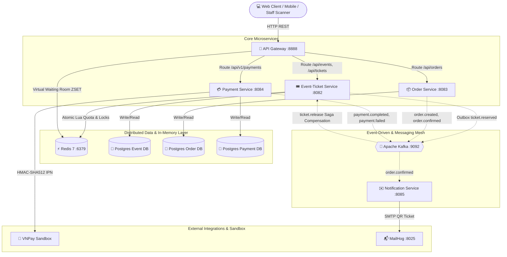

# ⚡ TICKETFLOW — HIGH-CONCURRENCY DISTRIBUTED TICKETING PLATFORM
> **A high-throughput distributed event ticketing and flash-sale platform engineered to handle massive traffic spikes, eliminate race conditions with Zero-Overselling guarantees, and maintain distributed data consistency across microservices.**

---

## 📑 TABLE OF CONTENTS
1. [Problem Statement & Engineering Challenges](#-1-problem-statement--engineering-challenges)
2. [System Architecture](#-2-system-architecture)
3. [Core Business Capabilities](#-3-core-business-capabilities)
4. [Technology Stack & Architectural Decisions](#-4-technology-stack--architectural-decisions)
5. [Recruiter Demo & Benchmark Scenarios](#-5-recruiter-demo--benchmark-scenarios)
6. [Quick Start & Installation](#-6-quick-start--installation)
7. [Service Registry & Port Mapping](#-7-service-registry--port-mapping)
8. [Author & Contact](#-8-author--contact)

---

## 🎯 1. PROBLEM STATEMENT & ENGINEERING CHALLENGES

During high-demand concert tours, sports finals, and flash-sale ticketing drops, online ticketing platforms face severe distributed systems challenges:
* **Traffic Spikes:** Hundreds of thousands of concurrent users hitting the booking endpoint within the exact same second.
* **Overselling (Race Conditions):** Multiple concurrent execution threads competing for the same inventory stock simultaneously.
* **Seat Contention:** Multiple users selecting the exact same reserved seat in the same millisecond.
* **Distributed Transactions:** A ticket order spans multiple microservices (Inventory Reservation $\rightarrow$ Payment Processing $\rightarrow$ Ticket Issuance $\rightarrow$ Email Dispatch). If payment fails or times out after 10 minutes, the system must automatically roll back inventory without leaking resources or leaving dangling locks.

**TicketFlow** is architected and built to solve these challenges using an **Event-Driven Microservices Architecture**, combining **Redis In-Memory Atomic Operations (Lua scripts & ZSET)**, **Distributed Sagas (Choreography)**, the **Transactional Outbox Pattern**, **Idempotent Consumers**, and **Multi-Database Isolation**.

---

## 🏗️ 2. SYSTEM ARCHITECTURE

The system is decomposed into decoupled microservices adhering to the **Database-per-Service** pattern, communicating asynchronously via **Apache Kafka (KRaft mode)** and synchronously through a **Reactive API Gateway**.



### Microservice Inventory:
1. **API Gateway (`gateway:8888`):** Built on Spring Cloud Gateway (Reactive WebFlux), handling unified routing, rate limiting, token relay, and **Virtual Waiting Room** traffic shaping using Redis ZSET.
2. **Event & Ticket Service (`event-ticket-service:8082`):** Manages events, ticket types, atomic inventory operations (<2ms Lua scripts), seat hold locks, and staff check-in ticket validation.
3. **Order Service (`order-service:8083`):** Coordinates distributed sagas, manages order state lifecycles (`PENDING` $\rightarrow$ `CONFIRMED` / `CANCELLED`), handles 10-minute hold expiration, and produces cached sales reports.
4. **Payment Service (`payment-service:8084`):** Integrates with VNPay Sandbox payment gateway, validates HMAC-SHA512 digital signatures, and handles asynchronous IPN callbacks.
5. **Notification Service (`notification-service:8085`):** Pure asynchronous Kafka consumer generating cryptographically signed QR codes and dispatching confirmation emails via MailHog.
6. **Frontend Web App & Benchmark Simulator (`frontend:3000`):** Modern Single Page Application featuring interactive seat maps, order workflows, live telemetry streams, and an integrated **Benchmark Test Simulator**.

---

## 💼 3. CORE BUSINESS CAPABILITIES

### 1. Dual-Model Ticketing Engine
The platform natively supports the two primary industry ticketing models:
* **Model A — Numbered Seat Reservation (Visual Seat Map):**
  * Displays an interactive visual matrix (Row A, B, C...).
  * Selecting a seat acquires a distributed lock in Redis (`seat_lock:{eventId}:{seatId}`) with a **10-minute TTL**.
  * **Strict Concurrency Control:** When two users click the same seat in the same millisecond, exactly one acquires the `HOLD`, while the other immediately receives an HTTP `409 Conflict`.
* **Model B — Standing Zone Quota / Flash Sale (General Admission):**
  * Built for GA zones and high-throughput flash sales without assigned seating.
  * Uses **Atomic Redis Lua Scripts** to verify stock and decrement quota in **< 2ms**, completely preventing overselling (Zero-Overselling guarantee).

### 2. Virtual Waiting Room (Traffic Shaping)
* When traffic exceeds capacity thresholds during mega ticket drops (e.g. > 100 req/s), the API Gateway automatically routes incoming requests into a Redis ZSET queue (`waiting_room:active_event`).
* Users receive HTTP `429 Too Many Requests` with their exact queue position and estimated wait time. Upon reaching the front of the queue, the system issues a time-bound `Queue-Pass-Token` (valid for 5 minutes) permitting access to checkout.

### 3. Distributed Saga & Automatic Compensation
* Coordinates distributed multi-service transactions using **Saga Choreography combined with the Transactional Outbox Pattern**:
  * **Success Path:** Customer pays via VNPay $\rightarrow$ `payment.completed` event $\rightarrow$ Order transitions to `CONFIRMED` $\rightarrow$ Seat transitions from `HOLD` to `BOOKED` $\rightarrow$ Notification service dispatches signed QR ticket via email.
  * **Failure / Expiration Path:** Customer cancels payment or allows the 10-minute window to elapse $\rightarrow$ `ticket.release` event is published $\rightarrow$ Event-Ticket Service executes compensating actions: unlocking seat to `FREE` and restoring standing quota back to Redis in-memory storage.

### 4. Gate Check-In & Anti-Fraud Scanner
* Tickets sent to customers contain QR codes embedded with **HMAC-SHA256 cryptographic signatures**.
* Staff scanning devices can verify ticket authenticity and integrity offline without exposing database bottlenecks.
* Utilizes Redis `SET NX` atomic checks at entry gates to prevent duplicate entry attempts (Anti-Fraud Double Scan) across multiple physical gates.

---

## 🛠️ 4. TECHNOLOGY STACK & ARCHITECTURAL DECISIONS

| Dimension | Technologies & Patterns | Engineering Purpose |
|:---|:---|:---|
| **Core Framework** | Java 21, Spring Boot 3.3+, Spring Cloud Gateway | High-performance microservices foundation leveraging Virtual Threads and Reactive WebFlux. |
| **In-Memory & Locking** | Redis 7, Lua Scripting, Redis ZSET | Atomic quota check-and-decrement (<2ms), 10-minute seat hold distributed locks, and virtual waiting room queues. |
| **Message Broker** | Apache Kafka 3.7 (KRaft Mode) | High-throughput asynchronous event mesh for decoupled inter-service domain event communication. |
| **Relational Database** | PostgreSQL 16 (Multi-Database Pattern) | Isolated schema per microservice guaranteeing ACID transactions and strict bounded context encapsulation. |
| **Data Consistency** | Transactional Outbox Pattern, Saga Compensation | At-least-once delivery guarantee, preventing distributed message loss without two-phase commit (2PC). |
| **Consumer Idempotency** | Composite Unique Key (`event_id`, `consumer_name`) | Absolute idempotency ensuring zero duplicate order processing during Kafka message re-deliveries. |
| **Distributed Scheduler** | ShedLock (Postgres Storage Provider) | Guarantees timeout cleaners and Outbox pollers run on exactly one instance across horizontally scaled replicas. |
| **Security & Cryptography** | OAuth2 / Keycloak JWT, HMAC-SHA256, HMAC-SHA512 | Zero-trust token relay, secure IPN payment callbacks, tamper-proof ticket QR verification. |
| **Local Integrations** | MailHog (SMTP), VNPay Sandbox, Kafka UI | Fully reproducible local development and testing environment with visual inspection tools. |

---

## 🧪 5. RECRUITER DEMO & BENCHMARK SCENARIOS

The frontend includes an integrated **Interactive Test Simulator** under the *"Test Simulator"* tab, enabling real-time verification of the platform's distributed reliability:

```
┌──────────────────────────────────────────────────────────────────────────────────┐
│                      TICKETFLOW TEST SIMULATOR BENCHMARK                         │
├──────────────────────────────────────────────────────────────────────────────────┤
│ [Scenario 1: Flash Sale Spike]  50-100 parallel requests -> Proves Zero Oversell │
│ [Scenario 2: Seat Race Condition] 2 users click same seat -> 1 HOLD, 1 409 Error │
│ [Scenario 3: 10-Min Hold Timeout] Abandoned order         -> Saga releases seat  │
│ [Scenario 4: Gate Double Scan]   Scan ticket at 2 gates  -> Red duplicate alert  │
└──────────────────────────────────────────────────────────────────────────────────┘
```

1. **Scenario 1 — Zero Overselling Under Flash Sale Spike:**
   * *Action:* Click *"Trigger Flash Sale Request Surge"* (Sends 50 or 100 concurrent HTTP requests).
   * *Observed Result:* System records live throughput and latency; requests exceeding available quota are immediately rejected with HTTP `400/409 Sold Out`; inventory count never drops below zero.
2. **Scenario 2 — Millisecond Seat Race Condition:**
   * *Action:* Click *"Trigger 2-User Simultaneous Seat Conflict"*.
   * *Observed Result:* Two concurrent users request the exact same seat at the same millisecond $\rightarrow$ User A successfully secures the `HOLD`, while User B instantly receives `409 Conflict` stating the seat is reserved.
3. **Scenario 3 — Payment Timeout & Automatic Saga Compensation:**
   * *Action:* Click *"Simulate Booking & 10-Minute Expiration"*.
   * *Observed Result:* Order is created as `PENDING` $\rightarrow$ Hold timeout triggers $\rightarrow$ Kafka consumer receives `ticket.release` $\rightarrow$ Seat status on the seat map automatically reverts to `FREE` for other attendees.
4. **Scenario 4 — Anti-Fraud Double Scan at Stadium Gates:**
   * *Action:* Click *"Simulate Double Scan at Multiple Gates"*.
   * *Observed Result:* First scan at Gate A returns `VALID TICKET — ACCESS GRANTED` $\rightarrow$ Second scan attempt at Gate B is immediately blocked by Redis with `ALERT: TICKET ALREADY USED`.

---

## 🚀 6. QUICK START & INSTALLATION

The entire distributed platform (PostgreSQL databases, Redis, Apache Kafka, Keycloak, Backend microservices, API Gateway, MailHog, and Frontend) is orchestrated via **Docker Compose** for single-command execution.

### Prerequisites:
* Docker & Docker Compose installed.
* Available RAM: 4GB - 6GB minimum.

### Setup Instructions:
```bash
# 1. Clone the repository
git clone https://github.com/tcnguywn/event-ticket-booking.git
cd event-ticket-booking

# 2. Build and launch all containers
docker compose up -d --build
```

After 30–60 seconds once containers report `healthy`, navigate to the web interfaces listed below.

---

## 🌐 7. SERVICE REGISTRY & PORT MAPPING

| Service / Component | URL | Description & Interface |
|:---|:---|:---|
| **Frontend Web App** | [`http://localhost:3000`](http://localhost:3000) | Event browsing, seat selection, checkout, and Test Simulator. |
| **API Gateway** | [`http://localhost:8888`](http://localhost:8888) | Centralized entry point and request router. |
| **MailHog Web UI** | [`http://localhost:8025`](http://localhost:8025) | Local SMTP mailbox for viewing confirmation emails & QR codes. |
| **Kafka UI** | [`http://localhost:8086`](http://localhost:8086) | Visual dashboard for topics, partitions, consumer groups, and messages. |
| **Keycloak Auth** | [`http://localhost:8080`](http://localhost:8080) | Identity provider and OpenID Connect / OAuth2 server. |
| **Event-Ticket Service** | [`http://localhost:8082`](http://localhost:8082) | Event administration, seat hold locking, and inventory management. |
| **Order Service** | [`http://localhost:8083`](http://localhost:8083) | Order state lifecycle management and sales reports. |
| **Payment Service** | [`http://localhost:8084`](http://localhost:8084) | VNPay Sandbox payment gateway integration. |
| **Notification Service** | [`http://localhost:8085`](http://localhost:8085) | Cryptographic QR ticket issuance and email delivery. |

---

## 👨‍💻 8. AUTHOR & CONTACT
* **Project:** TicketFlow — High-Concurrency Distributed Ticketing Platform
* **GitHub Repository:** [https://github.com/tcnguywn/event-ticket-booking](https://github.com/tcnguywn/event-ticket-booking)
* **Domain Focus:** Senior Java Backend Engineer / Distributed Systems Enthusiast.
