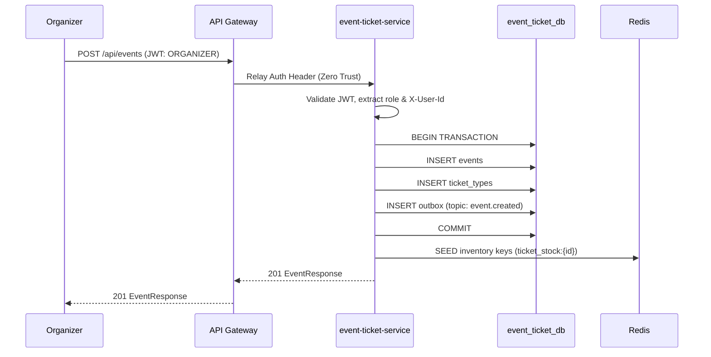
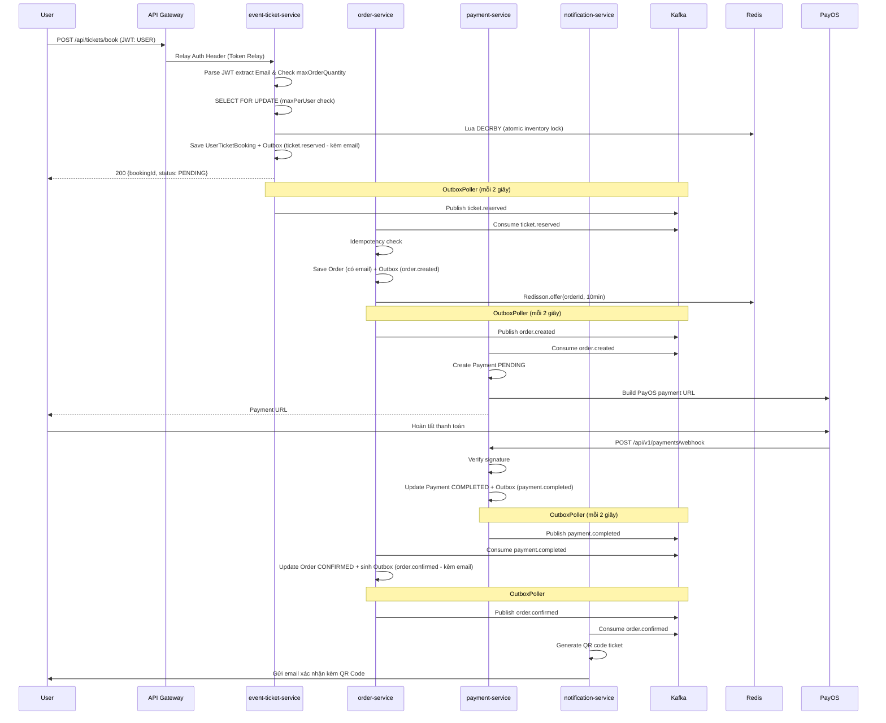
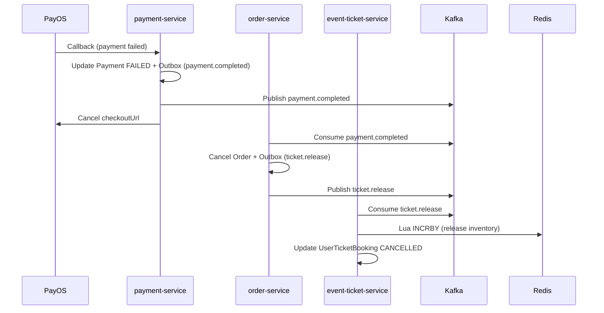
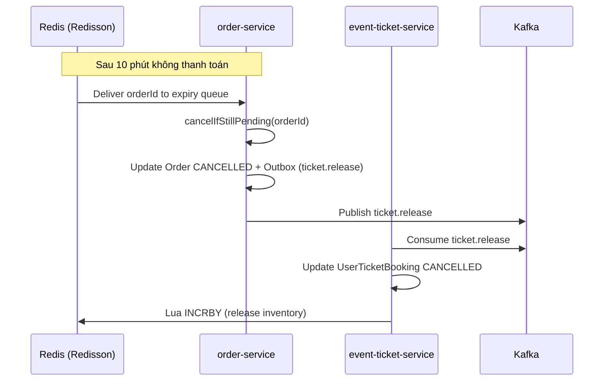
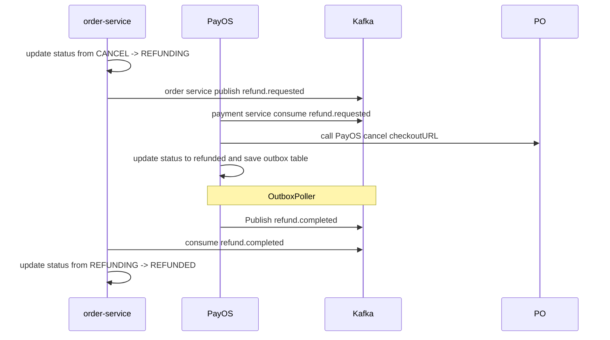

# 📊 Hệ thống Microservices — Phân tích và Thiết kế

Tài liệu này trình bày phân tích nghiệp vụ và thiết kế hướng dịch vụ cho hệ thống đặt vé sự kiện trực tuyến.

**Tài liệu tham khảo:**
1. *Service-Oriented Architecture: Analysis and Design for Services and Microservices* — Thomas Erl (2nd Edition)
2. *Microservices Patterns: With Examples in Java* — Chris Richardson
3. *Bài tập — Phát triển phần mềm hướng dịch vụ* — Hung DN (2024)

---

## 1. 🎯 Đặt vấn đề

- **Domain**: Event Management & Ticketing
- **Vấn đề**: Việc tổ chức và bán vé sự kiện theo cách truyền thống gặp nhiều vấn đề: quản lý vé thủ công dễ sai sót, không kiểm soát được số lượng vé theo thời gian thực dẫn đến oversell, thanh toán thiếu an toàn, và không có cơ chế xác nhận tự động. Hệ thống này giải quyết bằng cách số hóa toàn bộ quy trình từ tạo sự kiện → đặt vé → thanh toán → nhận vé điện tử.
- **Actors**:
  - **Guest** — duyệt và xem danh sách sự kiện, không cần đăng nhập
  - **User** — đăng nhập, đặt vé, thanh toán qua PayOS, nhận email xác nhận kèm QR code
  - **Organizer** — đăng nhập, tạo sự kiện, thiết lập loại vé và số lượng
- **Phạm vi (In scope)**:
  - Đăng ký / đăng nhập (Keycloak)
  - Tạo sự kiện và thiết lập loại vé (UC1)
  - Đặt vé, thanh toán qua PayOS, nhận QR code qua email (UC2)
  - Hoàn tiền tự động (compensation flow trong UC2)
- **Ngoài phạm vi (Out of scope)**:
  - Quản lý địa điểm / venue
  - Mobile app
  - Báo cáo thống kê nâng cao
  - Admin dashboard

---

## 2. 🧩 Phân tích hướng dịch vụ

### 2.1 Phân rã quy trình nghiệp vụ

**UC1 — Tạo sự kiện:**

| Bước | Hoạt động | Actor | Mô tả |
|------|-----------|-------|-------|
| 1 | Authenticate | Organizer | Đăng nhập qua Keycloak, nhận JWT với role ORGANIZER |
| 2 | Create event | Organizer | Nhập thông tin sự kiện: tiêu đề, mô tả, địa điểm, thời gian bắt đầu/kết thúc |
| 3 | Configure ticket types | Organizer | Thiết lập loại vé: tên, giá, số lượng, giới hạn mua mỗi người (maxPerUser) |
| 4 | Publish event | System | Lưu event + ticket types trong một transaction, khởi tạo inventory trên Redis |

**UC2 — Đặt vé:**

| Bước | Hoạt động | Actor | Mô tả |
|------|-----------|-------|-------|
| 1 | Browse events | Guest/User | Xem danh sách sự kiện đã được publish |
| 2 | Authenticate | User | Đăng nhập qua Keycloak để tiến hành đặt vé |
| 3 | Select ticket | User | Chọn loại vé và số lượng |
| 4 | Validate & lock inventory | System | Kiểm tra maxPerUser, khóa inventory bằng Redis Lua script (atomic) |
| 5 | Create order | System | Tạo order ở trạng thái PENDING, khởi động timer hết hạn 10 phút, produce tin nhắn sang cho payment |
| 6 | Payment | System | Payment-service consume tin nhắn từ Kafka, kiểm idempotency, gọi PayOS |
| 7 | User pay for ticket | User | User sẽ quét mã qr thanh toán trên trang checkoutURL của PayOS |
| 8 | Payment success | System | Payment service nhận được 1 webhook thông báo thanh toán thành công và produce message về cho order service |
| 9 | Confirm order | System | Consume message từ payment → cập nhật order thành CONFIRMED và sinh event `order.confirmed` mang theo Email |
| 10 | Send confirmation | System | Notification đọc `order.confirmed` -> Tạo QR code, gửi email xác nhận kèm QR |
| **E1** | Payment failed | System | PayOS callback thất bại → hoàn tiền tự động → nhả vé về inventory |
| **E2** | Order timeout | System | Không thanh toán trong 10 phút → tự động hủy order → nhả vé về inventory |

### 2.2 Xác định các Entity

| Entity | Attributes | Owned By |
|--------|-----------|----------|
| Event | id, title, description, location, start_time, end_time, status (DRAFT/PUBLISHED), organizer_id | event-ticket-service |
| TicketType | id, event_id, name, price, quantity, max_per_user, max_order_quantity | event-ticket-service |
| UserTicketBooking | id, user_id *(from JWT)*, event_id, ticket_type_id, quantity, status (PENDING/SENT/CANCELLED), idempotency_key | event-ticket-service |
| Order | id, user_id, email *(from JWT)*, event_id, ticket_type_id, quantity, total_price, status (PENDING/CONFIRMED/CANCELLED), idempotency_key | order-service |
| Payments | id, order_id, user_id, event_id, amount, status, payos_order_code, qr_code_url, checkout_url, payload, created_at, updated_at, expired_at | payment-service |
| Outbox | id, topic, payload, idempotency_key, status (PENDING/SENT), retry_count, max_retry | mỗi service (nội bộ) |

> **Lưu ý:** Không có User entity trong DB của hệ thống. Thông tin người dùng (userId, email, role) được quản lý hoàn toàn bởi Keycloak và các service chỉ đọc từ JWT claim khi cần.

### 2.3 Xác định các Service Candidate

Các service được xác định dựa trên 3 tiêu chí: **Business Capability**, **Bounded Context (DDD)**, **Data Ownership**.

| Service | Business Capability | Bounded Context | Dữ liệu sở hữu | Loại |
|---------|-------------------|-----------------|----------------|------|
| Keycloak | Xác thực & phân quyền | Identity | User accounts, roles, JWT | Infrastructure |
| API Gateway | Routing, rate limiting | Cross-cutting | — | Infrastructure |
| event-ticket-service | CRUD sự kiện, quản lý loại vé, khóa inventory | Event & Ticketing | Event, TicketType, UserTicketBooking | Entity + Task |
| order-service | Quản lý lifecycle đơn hàng, xử lý ghost reservation | Ordering | Order, Outbox | Entity + Task |
| payment-service | Tích hợp PayOS, xử lý callback, hoàn tiền tự động | Payment | Payment, Outbox | Entity + Task |
| notification-service | Tạo QR code, gửi email xác nhận | Notification | — *(stateless)* | Task |

**Lý do gộp Event và Ticket vào cùng một service:**
- Tạo sự kiện và thiết lập loại vé là một hành động nghiệp vụ duy nhất của Organizer (UC1) — cùng bounded context
- Inventory lock (Redis Lua) phải nằm cùng service với TicketType để tránh network hop khi decrement
- Nếu tách ra cần Saga chỉ để giữ nhất quán 2 entity đơn giản → over-engineering

---

## 3. 🔄 Thiết kế hướng dịch vụ

### 3.1 Service Inventory

| Service | Trách nhiệm | Loại |
|---------|------------|------|
| Keycloak | Phát hành JWT, quản lý role (USER/ORGANIZER), xử lý đăng nhập/đăng ký | Infrastructure |
| API Gateway | Định tuyến request, rate limiting (tối đa 3 order/phút/user), Relay Authorization Header (Token Relay) | Infrastructure / Utility |
| event-ticket-service | CRUD sự kiện, quản lý loại vé, khóa inventory atomic, tự xử lý JWT | Entity + Task |
| order-service | Quản lý vòng đời đơn (PENDING→CONFIRMED→CANCELLED), Saga choreography, tự xử lý JWT, đẩy `order.confirmed` mang Email tới notification | Entity + Task |
| payment-service | Tích hợp PayOS, xử lý callback, idempotency, hoàn tiền tự động | Entity + Task |
| notification-service | Tạo QR code, gửi email xác nhận qua SMTP | Task |

### 3.2 Service Capabilities (Interface Design)

**event-ticket-service (port 8081):**

| Capability | Method | Endpoint | Input | Output |
|-----------|--------|----------|-------|--------|
| Create event | POST | `/api/events` | `{title, description, location, startTime, endTime, ticketTypes[]}` | `EventResponse` |
| Get event list | GET | `/api/events` | `?page, ?status` | `EventResponse[]` |
| Get event detail | GET | `/api/events/{id}` | path: `id` | `EventResponse` |
| Book ticket | POST | `/api/tickets/book` | `{ticketTypeId, quantity}` | `{bookingId, status}` |
| Release ticket *(internal)* | POST | `/api/tickets/release` | `{ticketTypeId, quantity}` | `204 No Content` |

**order-service (port 8083):**

| Capability | Method | Endpoint | Input | Output |
|-----------|--------|----------|-------|--------|
| Get order detail | GET | `/api/orders/{id}` | path: `id` | `OrderResponse` |
| Get my orders | GET | `/api/orders/my` | `?page` | `OrderResponse[]` |
| Cancel order | POST | `/api/orders/{id}/cancel` | path: `id` | `OrderResponse` |

**payment-service (port 8084):**

| Capability | Method | Endpoint | Input | Output |
|-----------|--------|----------|-------|--------|
| Get payment URL | GET | `/api/payments/payos/url` | `?orderId` | `{paymentUrl}` |
| PayOS callback | POST | `/api/v1/payments/webhook` | PayOS webhook body | `{success}` |
| Refund | POST | `/api/payments/{orderId}/refund` | path: `orderId` | `{status, refundedAmount}` |

**notification-service (port 8085):**
> Không expose REST endpoint — pure Kafka consumer, stateless.

### 3.3 Service Interactions

**UC1 — Tạo sự kiện:**



**UC2 — Đặt vé (Happy Path):**



**UC2 — Exception 1: Thanh toán thất bại:**



**UC2 — Exception 2: Order hết hạn (Timeout):**



**UC2 — Exception 3: Refund:**



### 3.4 Data Ownership & Boundaries

| Data Entity | Owner Service | Cách service khác truy cập |
|-------------|--------------|---------------------------|
| Event | event-ticket-service | Đọc qua REST GET /api/events |
| TicketType | event-ticket-service | order-service đọc qua payload trong Kafka message ticket.reserved |
| UserTicketBooking | event-ticket-service | Không expose ra ngoài |
| Inventory *(Redis)* | event-ticket-service | Không chia sẻ — chỉ được thay đổi nội bộ qua Lua script |
| Order | order-service | User đọc qua GET /api/orders; các service khác nhận message từ Kafka |
| Payment | payment-service | order-service chỉ nhận kết quả qua Kafka event |
| Outbox | Mỗi service *(nội bộ)* | Không chia sẻ — pattern nội bộ của từng service |

---

## 4. 📋 API Specifications

Tài liệu API đầy đủ (OpenAPI 3.0) nằm tại:
- [`docs/api-specs/event-ticket-service.yaml`](api-specs/event-ticket-service.yaml)
- [`docs/api-specs/order-service.yaml`](api-specs/order-service.yaml)
- [`docs/api-specs/payment-service.yaml`](api-specs/payment-service.yaml)

---

## 5. 🗄️ Data Model

### event-ticket-service

```
┌──────────────────────┐       ┌───────────────────────────┐
│        events        │       │        ticket_types        │
├──────────────────────┤       ├───────────────────────────┤
│ id: UUID (PK)        │──────<│ id: UUID (PK)             │
│ title: VARCHAR(200)  │       │ event_id: UUID (FK)       │
│ description: TEXT    │       │ name: VARCHAR(100)        │
│ location: VARCHAR    │       │ price: BIGINT             │
│ organizer_id: UUID   │       │ quantity: INT             │
│ status: VARCHAR      │       │ max_per_user: INT         │
│ start_time: TIMESTAMP│       │ max_order_quantity: INT   │
│ end_time: TIMESTAMP  │       │ created_at: TIMESTAMP     │
│ created_at: TIMESTAMP│       └───────────────────────────┘
└──────────────────────┘

┌────────────────────────────┐      ┌──────────────────────────┐
│    user_ticket_booking     │      │          outbox          │
├────────────────────────────┤      ├──────────────────────────┤
│ id: UUID (PK)              │      │ id: UUID (PK)            │
│ user_id: UUID              │      │ topic: VARCHAR(100)      │
│ event_id: UUID             │      │ payload: JSONB           │
│ ticket_type_id: UUID (FK)  │      │ idempotency_key: UUID    │
│ quantity: INT              │      │ status: VARCHAR(10)      │
│ status: VARCHAR(20)        │      │ created_at: TIMESTAMP    │
│ idempotency_key: UUID      │      └──────────────────────────┘
│ created_at: TIMESTAMP      │
└────────────────────────────┘
```

### order-service

```
┌──────────────────────────┐      ┌──────────────────────────┐
│          orders          │      │          outbox          │
├──────────────────────────┤      ├──────────────────────────┤
│ id: UUID (PK)            │      │ id: UUID (PK)            │
│ user_id: UUID            │      │ topic: VARCHAR(100)      │
│ email: VARCHAR           │      │ payload: JSONB           │
│ event_id: UUID           │      │ idempotency_key: UUID    │
│ ticket_type_id: UUID     │      │ status: VARCHAR(10)      │
│ quantity: INT            │      │ created_at: TIMESTAMP    │
│ total_price: BIGINT      │      └──────────────────────────┘
│ status: VARCHAR(20)      │
│ idempotency_key: UUID    │      ┌──────────────────────────┐
│ created_at: TIMESTAMP    │      │    processed_events      │
│ updated_at: TIMESTAMP    │      ├──────────────────────────┤
└──────────────────────────┘      │ idempotency_key: UUID(PK)│
                                  │ processed_at: TIMESTAMP  │
                                  └──────────────────────────┘
```

### payment-service

```
┌──────────────────────────────┐          ┌──────────────────────────────┐
|          payments            |          |           outbox             |
├──────────────────────────────┤          ├──────────────────────────────┤
│ id: UUID (PK)                │          │ id: UUID (PK)                │
│ order_id: VARCHAR (UNIQUE)   │          │ aggregate_id: VARCHAR        │
│ user_id: VARCHAR             │          │ event_type: VARCHAR          │
│ event_id: VARCHAR            │          │ topic: VARCHAR               │
│ amount: BIGINT               │          │ payload: JSONB               │
│ status: VARCHAR(50)          │          │ status: VARCHAR(50)          │
│ payos_order_code: BIGINT (U) │          │ retry_count: INTEGER         │
│ qr_code_url: VARCHAR(1000)   │          │ max_retry: INTEGER           │
│ checkout_url: VARCHAR(1000)  │          │ created_at: TIMESTAMP        │
│ idempotency_key: VARCHAR (U) │          │ processed_at: TIMESTAMP      │
│ payload: TEXT                │          │ next_retry_at: TIMESTAMP     │
│ created_at: TIMESTAMP        │          └──────────────────────────────┘
│ updated_at: TIMESTAMP        │
│ expired_at: TIMESTAMP        │
└──────────────────────────────┘
```

---

## 6. ❗ Yêu cầu phi chức năng

| Yêu cầu | Mô tả |
|---------|-------|
| Performance | Thời gian phản hồi API < 500ms trong điều kiện bình thường |
| Scalability | Hỗ trợ scale độc lập từng service khi tải tăng (ví dụ: scale event-ticket-service khi sự kiện hot) |
| Availability | Không có single point of failure: Redis Sentinel (3 node), Kafka 3 broker, replication factor = 3 |
| Consistency | Eventual consistency qua Saga choreography; inventory lock đảm bảo không oversell |
| Security | JWT authentication (Keycloak), HTTPS, input validation, rate limiting (3 order/phút/user) |
| Reliability | Outbox Pattern đảm bảo không mất Kafka message; idempotency consumer tránh xử lý trùng lặp |
| Fault Tolerance | Dead Letter Topic cho message thất bại sau 3 lần retry; safety net @Scheduled cho ghost reservation |
