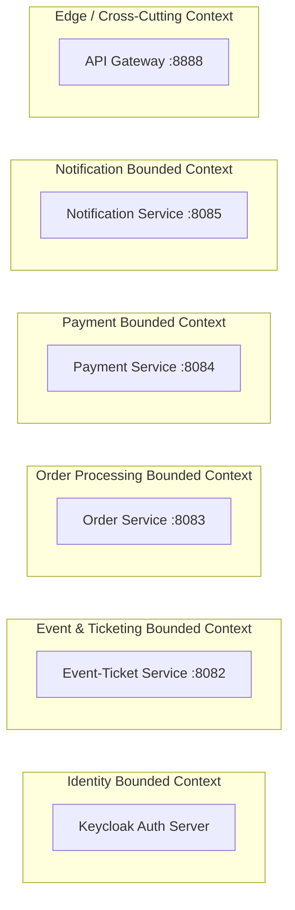
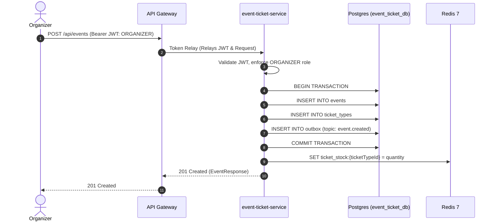
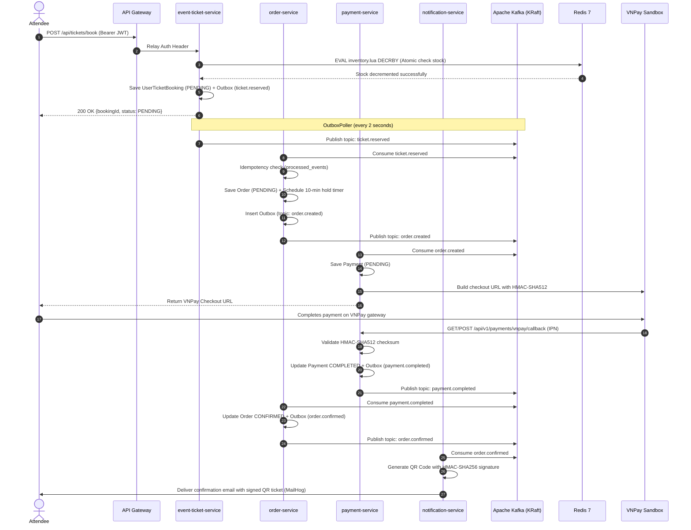
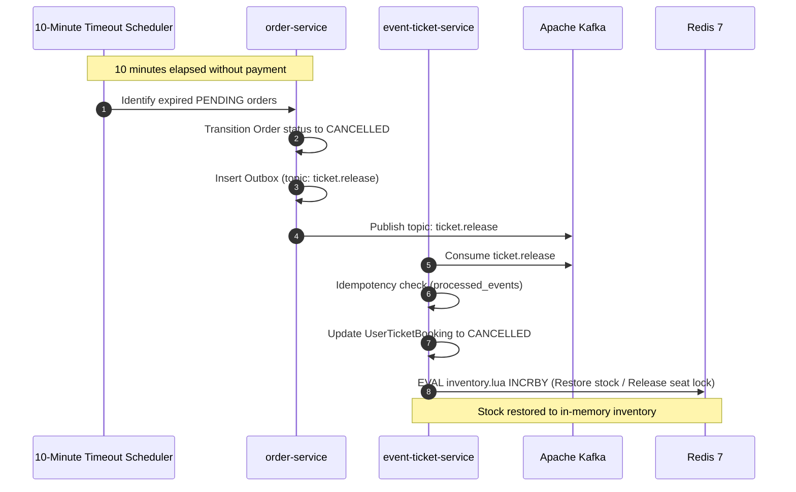
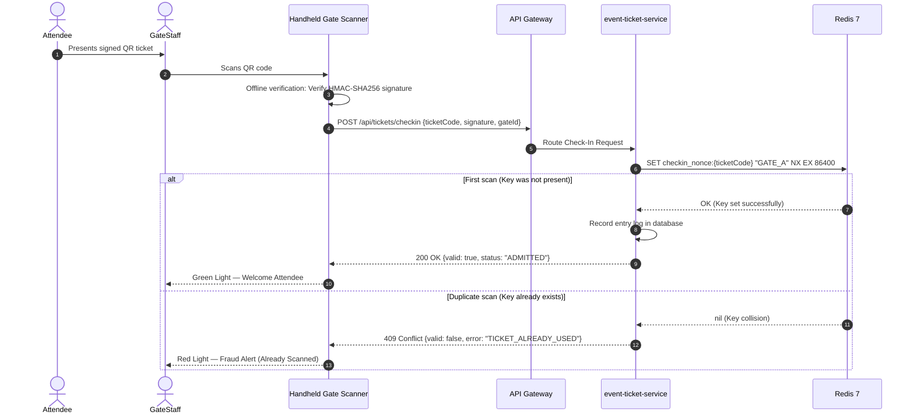

# 📊 Microservices System Analysis and Design Specification

This document presents the comprehensive Service-Oriented Analysis and Design (SOAD) for **TicketFlow**, a distributed, high-concurrency online event ticketing and flash-sale platform.

**Academic & Industry References:**
1. *Service-Oriented Architecture: Analysis and Design for Services and Microservices* — Thomas Erl (2nd Edition)
2. *Microservices Patterns: With Examples in Java* — Chris Richardson
3. *Domain-Driven Design: Tackling Complexity in the Heart of Software* — Eric Evans

---

## 1. 🎯 Problem Statement & Scope Definition

### 1.1 Domain Background
Online ticketing for high-demand concerts, major sports tournaments, and flash sales involves extreme traffic surges within sub-second intervals. Traditional monolithic or synchronous relational database systems face major bottlenecks:
* **Race Conditions & Overselling:** Unsynchronized concurrent inventory decrements lead to selling more tickets than available capacity.
* **Seat Contention:** Multiple concurrent users clicking the exact same reserved seat in the same millisecond.
* **Cascading Failures in Distributed Transactions:** Long multi-service workflows (Booking $\rightarrow$ Payment $\rightarrow$ Ticket Issuance) often fail due to network interruptions or abandoned payments, causing orphaned locks and inconsistent states.

TicketFlow solves these problems by decoupling business capabilities into autonomous microservices with **Database-per-Service isolation**, leveraging **In-Memory Atomic Operations (Redis Lua & ZSET)**, **Distributed Saga Choreography**, **Transactional Outbox**, and **Cryptographic Verification**.

### 1.2 System Actors
* **Guest:** Unauthenticated visitor browsing and searching published events.
* **User (Attendee):** Authenticated customer who queues in the Virtual Waiting Room, selects seats/quotas, executes VNPay payments, and receives cryptographically signed QR tickets.
* **Organizer:** Authenticated event administrator with `ORGANIZER` role, responsible for creating events, configuring seating maps / ticket quotas, and publishing inventory.
* **Gate Staff (Scanner):** Venue personnel who scan attendee QR codes at entrance gates to verify ticket authenticity and prevent duplicate entry.
* **Automated System Actors:** Scheduled background workers (ShedLock outbox pollers, 10-minute hold expiration schedulers, DLQ retry monitors).

### 1.3 Scope Boundaries
* **In Scope:**
  * OAuth2 / OpenID Connect authentication via Keycloak with Token Relay.
  * Event lifecycle management and seating/quota configuration (UC1).
  * High-concurrency ticket reservation, VNPay payment processing, and email dispatch with signed QR codes (UC2).
  * Distributed Saga compensation for payment failures and 10-minute hold timeouts.
  * Anti-fraud stadium gate check-in with offline cryptographic verification (UC3).
  * Real-time sales analytics and cached reporting.
* **Out of Scope:**
  * Complex multi-tenant venue facility CAD layout editors.
  * Native iOS / Android client applications (covered via responsive web SPA).
  * Hardware NFC turnstile driver integrations.

---

## 2. 🧩 Service-Oriented Analysis

### 2.1 Business Process Decomposition

#### UC1 — Event Creation & Inventory Seeding
| Step | Action | Actor | Description |
|:---|:---|:---|:---|
| 1 | Authenticate | Organizer | Logs in via Keycloak and receives a JWT bearing the `ORGANIZER` role. |
| 2 | Create Event | Organizer | Enters event details: title, description, venue location, start/end timestamps. |
| 3 | Configure Ticket Types | Organizer | Defines ticket tiers: name, pricing, total quantity, `maxPerUser`, and `maxOrderQuantity`. |
| 4 | Publish Event & Seed Inventory | System | Persists event and ticket tiers atomically within `event_ticket_db`, then initializes Redis in-memory inventory keys (`ticket_stock:{ticketTypeId}`). |

#### UC2 — High-Concurrency Ticket Booking & Flash Sale Checkout
| Step | Action | Actor | Description |
|:---|:---|:---|:---|
| 1 | Browse Events | Guest / User | Browses or searches published events via API Gateway. |
| 2 | Authenticate | User | Authenticates via Keycloak to acquire access token with email and user claims. |
| 3 | Virtual Waiting Room | System | If traffic exceeds throughput thresholds, routes user to Redis ZSET queue until a `Queue-Pass-Token` is issued. |
| 4 | Select Seat / Quota | User | Submits reservation request for specific seats or general admission standing quota. |
| 5 | Validate & Atomic Lock | System | Executes atomic Redis Lua script (<2ms) to decrement stock or acquires a distributed Redis lock (`seat_lock:{eventId}:{seatId}`) with a 10-minute TTL. |
| 6 | Create Order | System | Creates order in `PENDING` status, schedules a 10-minute hold expiration timer, and inserts a `ticket.reserved` domain event into the Outbox table. |
| 7 | Payment Initiation | System | `payment-service` consumes `order.created` event, creates a `PENDING` payment, and builds the VNPay Sandbox payment checkout URL. |
| 8 | Checkout Execution | User | User completes payment on the VNPay Sandbox checkout gateway. |
| 9 | Payment Webhook Callback | System | `payment-service` receives IPN webhook from VNPay, validates HMAC-SHA512 checksum, updates payment status to `COMPLETED`, and writes `payment.completed` to Outbox. |
| 10 | Confirm Order | System | `order-service` consumes `payment.completed`, transitions order status to `CONFIRMED`, and publishes `order.confirmed` carrying attendee email. |
| 11 | Issue QR Ticket | System | `notification-service` consumes `order.confirmed`, generates an HMAC-SHA256 digitally signed QR code, and dispatches an HTML confirmation email via MailHog. |
| **E1** | Payment Failure | System | VNPay webhook reports payment failure $\rightarrow$ Order transitions to `CANCELLED` $\rightarrow$ `ticket.release` event is emitted $\rightarrow$ Redis inventory / seat lock is released. |
| **E2** | 10-Minute Hold Expiration | System | Payment is not completed within 10 minutes $\rightarrow$ Scheduler triggers cancellation $\rightarrow$ `ticket.release` restores quota / unlocks seat to `FREE`. |
| **E3** | Order Refund | System | User/Organizer requests cancellation of a paid order $\rightarrow$ Order transitions to `REFUNDING` $\rightarrow$ Payment service executes refund $\rightarrow$ Order transitions to `REFUNDED`. |

#### UC3 — Gate Check-In & Anti-Fraud Scan
| Step | Action | Actor | Description |
|:---|:---|:---|:---|
| 1 | Present Ticket | Attendee | Presents electronic ticket QR code at venue turnstile. |
| 2 | Scan & Offline Verify | Gate Staff | Scanner extracts payload and validates HMAC-SHA256 signature against secret key. |
| 3 | Double-Scan Check | System | Gate scanner invokes check-in endpoint; Redis `SET NX` ensures ticket has not been used at any gate previously. |
| 4 | Grant Admission | Gate Staff | System confirms valid entry and records entry timestamp. |

---

### 2.2 Entity & Value Object Identification

| Entity / Object | Key Attributes | Owned Service | Storage Layer |
|:---|:---|:---|:---|
| **Event** | `id`, `title`, `description`, `location`, `start_time`, `end_time`, `status`, `organizer_id`, `created_at` | `event-ticket-service` | PostgreSQL (`event_ticket_db`) |
| **TicketType** | `id`, `event_id`, `name`, `price`, `quantity`, `max_per_user`, `max_order_quantity`, `created_at` | `event-ticket-service` | PostgreSQL (`event_ticket_db`) |
| **UserTicketBooking** | `id`, `user_id`, `event_id`, `ticket_type_id`, `quantity`, `seat_id`, `status`, `idempotency_key`, `created_at` | `event-ticket-service` | PostgreSQL (`event_ticket_db`) |
| **SeatLock / Quota** | `seat_lock:{eventId}:{seatId}`, `ticket_stock:{ticketTypeId}` | `event-ticket-service` | Redis 7 In-Memory |
| **Order** | `id`, `user_id`, `email`, `event_id`, `ticket_type_id`, `quantity`, `total_price`, `status`, `idempotency_key`, `created_at`, `updated_at` | `order-service` | PostgreSQL (`order_db`) |
| **Payment** | `id`, `order_id`, `user_id`, `event_id`, `amount`, `status`, `vnpay_txn_ref`, `qr_code_url`, `checkout_url`, `idempotency_key`, `created_at`, `updated_at`, `expired_at` | `payment-service` | PostgreSQL (`payment_db`) |
| **Outbox** | `id`, `aggregate_id`, `event_type`, `topic`, `payload` (JSONB), `status`, `retry_count`, `created_at`, `processed_at` | Each Service (Internal) | PostgreSQL (Per-service DB) |
| **ProcessedEvents** | `idempotency_key` (PK), `consumer_name`, `processed_at` | Each Service (Internal) | PostgreSQL (Per-service DB) |

> **Architectural Note:** User identity attributes (`userId`, `email`, `roles`) are managed centrally by Keycloak. Business microservices maintain no duplicate user table, reading verified identity claims directly from incoming JWT tokens via the Gateway's Token Relay mechanism.

---

### 2.3 Service Candidates & DDD Bounded Contexts

Services are derived according to **Domain-Driven Design (DDD)** Bounded Contexts, **Single Responsibility Principle (SRP)**, and **Independent Scalability**:



#### Co-location Rationale for Event and Ticket Capabilities:
1. **Atomic Inventory Boundary:** Managing event details, ticket tier capacity, and Redis inventory synchronization represents a single cohesive aggregate root.
2. **Elimination of Distributed Locks for CRUD:** Separating Event and Ticket into distinct microservices would require 2-Phase Commit (2PC) or distributed sagas for simple event configuration changes, introducing unnecessary operational complexity.

---

## 3. 🔄 Service-Oriented Design

### 3.1 Service Inventory & Classification

| Service | Primary Responsibility | Service Category | Runtime Port |
|:---|:---|:---|:---|
| **Keycloak** | Issues signed JWT tokens, enforces RBAC (`USER`, `ORGANIZER`), handles OIDC registration/login. | Infrastructure / Identity | `8080` |
| **API Gateway** | Unified entry point, JWT token relay, rate limiting, and virtual waiting room traffic shaping. | Infrastructure / Utility | `8888` |
| **event-ticket-service** | Event administration, ticket tier configuration, Redis atomic stock decrement (<2ms), seat hold locks, gate check-in. | Entity + Task Service | `8082` |
| **order-service** | Order lifecycle orchestration (`PENDING` $\rightarrow$ `CONFIRMED` $\rightarrow$ `CANCELLED`), 10-minute hold expiration management, cached sales reporting. | Entity + Task Service | `8083` |
| **payment-service** | VNPay Sandbox integration, HMAC-SHA512 IPN webhook verification, refund execution, and payment state tracking. | Entity + Task Service | `8084` |
| **notification-service** | Consumes `order.confirmed` events, creates cryptographically signed QR codes (HMAC-SHA256), and delivers HTML emails via MailHog. | Task Service (Stateless) | `8085` |

---

### 3.2 Service Capabilities & REST Interface Specifications

#### 1. event-ticket-service (`:8082`)

| Capability | Method | Endpoint | Request Payload | Response / Status |
|:---|:---|:---|:---|:---|
| **Create Event** | `POST` | `/api/events` | `{title, description, location, startTime, endTime, ticketTypes: [...]}` | `201 Created` (`EventResponse`) |
| **List Events** | `GET` | `/api/events` | Query params: `page`, `size`, `status` | `200 OK` (`Page<EventResponse>`) |
| **Get Event Detail** | `GET` | `/api/events/{id}` | Path param: `id` | `200 OK` (`EventResponse`) |
| **Book Standing Ticket** | `POST` | `/api/tickets/book` | `{ticketTypeId, quantity}` | `200 OK` (`{bookingId, status: "PENDING"}`) |
| **Hold Numbered Seat** | `POST` | `/api/tickets/hold` | `{eventId, seatId, ticketTypeId}` | `200 OK` (`{seatId, status: "HOLD", ttlSeconds: 600}`) |
| **Release Ticket (Internal)** | `POST` | `/api/tickets/release` | `{ticketTypeId, quantity, seatId}` | `204 No Content` |
| **Staff Check-In** | `POST` | `/api/tickets/checkin` | `{ticketCode, signature, gateId}` | `200 OK` (`{valid: true, checkedInAt}`) |

#### 2. order-service (`:8083`)

| Capability | Method | Endpoint | Request Payload | Response / Status |
|:---|:---|:---|:---|:---|
| **Get Order by ID** | `GET` | `/api/orders/{id}` | Path param: `id` | `200 OK` (`OrderResponse`) |
| **Get My Orders** | `GET` | `/api/orders/my` | Header: `Authorization: Bearer <JWT>` | `200 OK` (`List<OrderResponse>`) |
| **Cancel Order** | `POST` | `/api/orders/{id}/cancel` | Path param: `id` | `200 OK` (`OrderResponse`) |
| **Sales Report** | `GET` | `/api/orders/reports/sales` | Query params: `eventId`, `from`, `to` | `200 OK` (`SalesReportDTO`) |

#### 3. payment-service (`:8084`)

| Capability | Method | Endpoint | Request Payload | Response / Status |
|:---|:---|:---|:---|:---|
| **Create Payment URL** | `POST` | `/api/v1/payments/create` | `{orderId, amount, orderInfo}` | `200 OK` (`{paymentUrl, vnpayTxnRef}`) |
| **VNPay IPN Webhook** | `GET`/`POST` | `/api/v1/payments/vnpay/callback` | VNPay IPN query parameters & signature | `200 OK` (`{RspCode: "00", Message: "Confirm Success"}`) |
| **Process Refund** | `POST` | `/api/v1/payments/{orderId}/refund` | `{orderId, amount, reason}` | `200 OK` (`{status: "REFUNDED", refundedAmount}`) |

#### 4. notification-service (`:8085`)
* **Interface:** Pure Kafka Consumer (No external REST endpoints exposed).
* **Consumes:** Topic `order.confirmed`.
* **Output:** Generates signed QR codes, sends emails via SMTP (`mailhog:1025`).

---

### 3.3 Service Interaction Models & Sequence Diagrams

#### UC1 — Event Creation & Inventory Provisioning


#### UC2 — Ticket Booking Happy Path (Flash Sale & VNPay Checkout)


#### UC2 — Exception 1: Payment Timeout & Automatic Saga Compensation


#### UC3 — Stadium Gate Check-In & Anti-Fraud Scan


---

## 4. 🗄️ Data Models & Schema Design

### 4.1 Relational Database Schemas (PostgreSQL Multi-Database)

#### `event_ticket_db` (Owned by `event-ticket-service`)
```
┌─────────────────────────────────┐       ┌─────────────────────────────────┐
│             events              │       │          ticket_types           │
├─────────────────────────────────┤       ├─────────────────────────────────┤
│ id: UUID (PK)                   │───<───│ id: UUID (PK)                   │
│ title: VARCHAR(200)             │       │ event_id: UUID (FK)             │
│ description: TEXT               │       │ name: VARCHAR(100)              │
│ location: VARCHAR(255)          │       │ price: BIGINT                   │
│ organizer_id: UUID              │       │ quantity: INT                   │
│ status: VARCHAR(50)             │       │ max_per_user: INT               │
│ start_time: TIMESTAMP           │       │ max_order_quantity: INT         │
│ end_time: TIMESTAMP             │       │ created_at: TIMESTAMP           │
│ created_at: TIMESTAMP           │       └─────────────────────────────────┘
└─────────────────────────────────┘

┌─────────────────────────────────┐       ┌─────────────────────────────────┐
│       user_ticket_booking       │       │             outbox              │
├─────────────────────────────────┤       ├─────────────────────────────────┤
│ id: UUID (PK)                   │       │ id: UUID (PK)                   │
│ user_id: UUID                   │       │ aggregate_id: VARCHAR(100)      │
│ event_id: UUID                  │       │ event_type: VARCHAR(100)        │
│ ticket_type_id: UUID (FK)       │       │ topic: VARCHAR(100)             │
│ seat_id: VARCHAR(50)            │       │ payload: JSONB                  │
│ quantity: INT                   │       │ status: VARCHAR(20)             │
│ status: VARCHAR(20)             │       │ retry_count: INT                │
│ idempotency_key: VARCHAR(100)   │       │ created_at: TIMESTAMP           │
│ created_at: TIMESTAMP           │       │ processed_at: TIMESTAMP         │
└─────────────────────────────────┘       └─────────────────────────────────┘
```

#### `order_db` (Owned by `order-service`)
```
┌─────────────────────────────────┐       ┌─────────────────────────────────┐
│             orders              │       │        processed_events         │
├─────────────────────────────────┤       ├─────────────────────────────────┤
│ id: UUID (PK)                   │       │ idempotency_key: VARCHAR(100)   │
│ user_id: UUID                   │       │ consumer_name: VARCHAR(100)     │
│ email: VARCHAR(255)             │       │ processed_at: TIMESTAMP         │
│ event_id: UUID                  │       │ PRIMARY KEY (idempotency_key,   │
│ ticket_type_id: UUID            │       │              consumer_name)     │
│ quantity: INT                   │       └─────────────────────────────────┘
│ total_price: BIGINT             │
│ status: VARCHAR(30)             │
│ idempotency_key: VARCHAR(100)   │
│ created_at: TIMESTAMP           │
│ updated_at: TIMESTAMP           │
└─────────────────────────────────┘
```

#### `payment_db` (Owned by `payment-service`)
```
┌─────────────────────────────────┐       ┌─────────────────────────────────┐
│            payments             │       │             outbox              │
├─────────────────────────────────┤       ├─────────────────────────────────┤
│ id: UUID (PK)                   │       │ id: UUID (PK)                   │
│ order_id: VARCHAR(100) (UNIQUE) │       │ aggregate_id: VARCHAR(100)      │
│ user_id: VARCHAR(100)           │       │ topic: VARCHAR(100)             │
│ event_id: VARCHAR(100)          │       │ payload: JSONB                  │
│ amount: BIGINT                  │       │ status: VARCHAR(20)             │
│ status: VARCHAR(50)             │       │ retry_count: INT                │
│ vnpay_txn_ref: VARCHAR(100)     │       │ created_at: TIMESTAMP           │
│ qr_code_url: VARCHAR(1000)      │       │ processed_at: TIMESTAMP         │
│ checkout_url: VARCHAR(1000)     │       └─────────────────────────────────┘
│ idempotency_key: VARCHAR(100)   │
│ created_at: TIMESTAMP           │
│ updated_at: TIMESTAMP           │
│ expired_at: TIMESTAMP           │
└─────────────────────────────────┘
```

---

### 4.2 In-Memory Data Structures (Redis 7)

| Key Pattern | Data Type | Purpose & TTL |
|:---|:---|:---|
| `ticket_stock:{ticketTypeId}` | String (Integer) | Real-time atomic inventory counter manipulated exclusively via Lua script. |
| `seat_lock:{eventId}:{seatId}` | String (`userId`) | Distributed lock holding a specific seat. TTL: 600 seconds (10 minutes). |
| `waiting_room:{eventId}` | Sorted Set (ZSET) | Score = arrival timestamp (epoch ms). Manages FIFO Virtual Waiting Room order. |
| `queue_pass:{token}` | String (`userId`) | Access pass issued when dequeued from waiting room. TTL: 300 seconds (5 minutes). |
| `checkin_nonce:{ticketCode}` | String (`gateId`) | Anti-fraud double-scan protection key set with `NX`. TTL: 86400 seconds (24h). |

---

## 5. ❗ Non-Functional Requirements (NFRs)

| NFR Category | Target Metric | Implementation Mechanism |
|:---|:---|:---|
| **Performance** | API Latency < 500ms (P99); Lua Stock Decrement < 2ms | In-memory atomic stock execution in Redis, non-blocking asynchronous event emission. |
| **High Concurrency** | Zero-Overselling guarantee under 100+ concurrent requests | Atomic Lua script (`inventory.lua`) combining check-and-decrement in a single Redis engine step. |
| **Consistency** | Eventual Consistency across distributed services | Saga Choreography over Kafka combined with Transactional Outbox pattern. |
| **Reliability** | Zero Message Loss (At-Least-Once Delivery) | Database transaction writes to Outbox table; polled via `@Scheduled` and ShedLock. |
| **Idempotency** | Exact-once business processing semantics | Composite primary key on consumer side (`processed_events`) with `ON CONFLICT DO NOTHING`. |
| **Security** | Zero-Trust Token Relay, Cryptographic verification | Stateless JWT claim validation at Gateway & Services; HMAC-SHA512 IPN validation; HMAC-SHA256 QR signatures. |
| **Fault Tolerance** | Automatic Failover & Non-blocking Error Handling | Kafka Dead Letter Topics (`.DLT`) for poison pills after 3 retries (1s, 2s, 4s backoff). |
