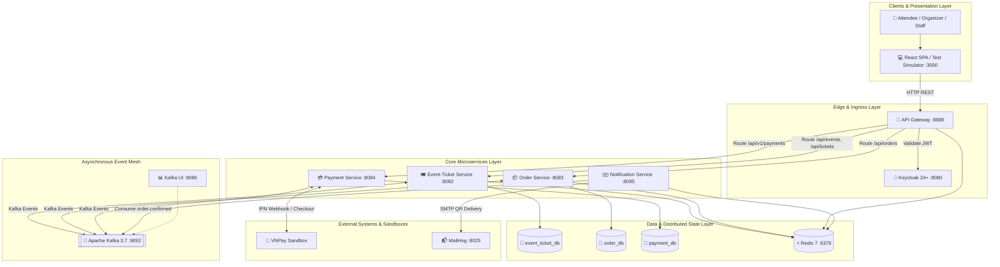
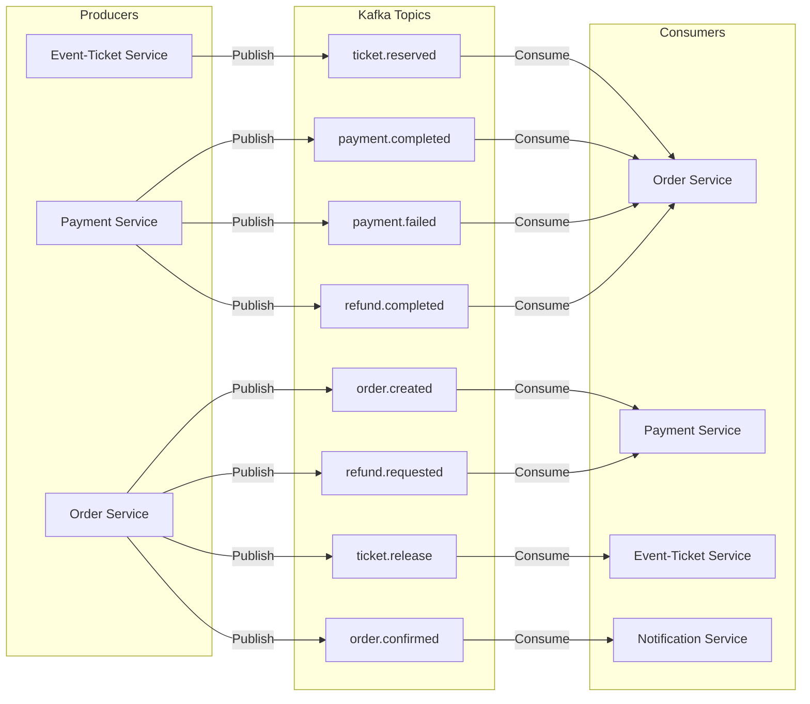

# 🏗️ System Architecture Document (SAD)

## 1. Executive Overview & System Topology

**TicketFlow** is a distributed, event-driven event ticketing and flash-sale platform engineered to maintain absolute data consistency, eliminate race conditions (Zero-Overselling), and provide sub-second responsiveness during extreme traffic surges.

### Core Architectural Pillars:
* **Database-per-Service Isolation:** Strict encapsulation of domain data models; zero cross-database queries or shared tables.
* **Event-Driven Asynchronous Choreography:** High-throughput event streaming via **Apache Kafka (KRaft mode)** decouples service lifecycles.
* **In-Memory Atomic Concurrency Control:** **Redis 7 Lua scripts** perform atomic check-and-decrement operations in under 2ms; **Redis distributed locks** manage 10-minute seat reservations.
* **Transactional Reliability:** **Transactional Outbox Pattern** combined with **ShedLock** and **Idempotent Consumers** guarantees at-least-once delivery without message loss or duplicate processing.
* **Zero-Trust Security & Cryptography:** Centralized OAuth2/OIDC token issuance via Keycloak, transparent Gateway Token Relay, VNPay HMAC-SHA512 checksum verification, and offline-verifiable HMAC-SHA256 digital signatures on QR tickets.



---

## 2. Architectural Patterns & Design Principles

### 2.1 Database-per-Service Pattern
Each business microservice owns and manages its dedicated PostgreSQL schema. Direct database access from one service to another is strictly prohibited. Cross-service data requirements are satisfied through asynchronous domain events or explicit REST API contracts.

### 2.2 Event-Driven Architecture (EDA) & Saga Choreography
Long-running business workflows (such as ticket checkout, payment verification, hold expiration, and refunds) are coordinated via **Saga Choreography**:
* Services publish domain events to Apache Kafka when their local transactions succeed.
* Downstream services consume these events, execute local state transitions, and emit subsequent events.
* If a failure occurs (e.g. payment failed or 10-minute hold expired), compensating events (`ticket.release`) trigger rollback operations in upstream services.

### 2.3 Transactional Outbox Pattern with ShedLock
To prevent the dual-write hazard between PostgreSQL and Apache Kafka:
1. Business entity updates and corresponding domain event records are committed into the database within the **same local ACID transaction**.
2. A background worker (`OutboxPoller`) polls unpublished events every 2 seconds and publishes them to Kafka.
3. **ShedLock** enforces distributed mutual exclusion on the outbox poller, ensuring that exactly one service instance processes the outbox queue even when horizontally scaled across multiple containers.

### 2.4 Idempotent Consumer Pattern
To achieve exact-once processing semantics over an at-least-once messaging transport:
* Each consumer maintains a `processed_events` table keyed by a composite primary key: `(idempotency_key, consumer_name)`.
* Messages are processed within a transaction using `INSERT INTO processed_events ... ON CONFLICT DO NOTHING`. If a conflict occurs, the duplicate message is safely ignored.

### 2.5 In-Memory Atomic Operations (Redis Lua & ZSET)
* **General Admission Quota:** An atomic Lua script (`inventory.lua`) checks available stock and decrements quota directly inside Redis memory in `< 2ms`, completely eliminating race conditions.
* **Numbered Seat Hold:** Distributed lock keys (`seat_lock:{eventId}:{seatId}`) secure specific seats with an explicit **10-minute TTL (Time-To-Live)**.
* **Virtual Waiting Room:** Redis Sorted Sets (`waiting_room:{eventId}`) queue burst traffic in FIFO order using arrival millisecond timestamps as scores.

### 2.6 Zero-Trust Gateway & Token Relay
The API Gateway validates JWT signatures against Keycloak's JWKS endpoint. Once authenticated, the Gateway relays the intact `Authorization: Bearer <JWT>` header to downstream microservices, allowing backend services to independently verify claims and extract user identities (`userId`, `email`, `roles`).

---

## 3. Component Inventory & Port Registry

| Component | Role & Responsibility | Tech Stack | Runtime Port | Healthcheck |
|:---|:---|:---|:---|:---|
| **Frontend** | Responsive SPA, interactive seat maps, live telemetry stream, and recruiter benchmark simulator. | React, Vite, Tailwind/Vanilla CSS | `3000` | HTTP `GET /` |
| **API Gateway** | Unified entry point, JWT validation, rate limiting, and virtual waiting room traffic management. | Spring Cloud Gateway, Reactive WebFlux | `8888` | `/actuator/health` |
| **Keycloak** | Identity Provider (IdP), OAuth2 / OIDC server, JWT issuance, and RBAC role assignment. | Keycloak 24.0.5 (Quarkus) | `8080` | `/health/ready` |
| **Event-Ticket Service** | Event administration, ticket tiers, Redis atomic stock decrement (<2ms), seat hold locks, gate check-in. | Spring Boot 3.3, JPA, Redis, Kafka | `8082` | `/actuator/health` |
| **Order Service** | Order state lifecycle management, 10-minute hold expiration scheduling, cached sales reporting. | Spring Boot 3.3, JPA, Redis, Kafka | `8083` | `/actuator/health` |
| **Payment Service** | VNPay Sandbox integration, HMAC-SHA512 IPN signature validation, payment state tracking, refunds. | Spring Boot 3.3, JPA, Kafka | `8084` | `/actuator/health` |
| **Notification Service** | Pure Kafka consumer generating HMAC-SHA256 signed QR codes and dispatching confirmation emails. | Spring Boot 3.3, JavaMail, Kafka | `8085` | `/actuator/health` |
| **Apache Kafka** | Distributed message broker operating in KRaft mode (no ZooKeeper dependency). | Apache Kafka 3.7.0 | `9092` (Ext), `29092` (Int) | `kafka-broker-api-versions.sh` |
| **Kafka UI** | Visual management console for Kafka topics, consumer groups, offsets, and messages. | Provectus Kafka UI | `8086` | HTTP `GET /` |
| **Redis 7** | In-memory atomic inventory counter, distributed locks, rate limiting, and waiting room queue. | Redis 7 Alpine | `6379` | `redis-cli ping` |
| **PostgreSQL 16** | Relational storage for business services (`event_ticket_db`, `order_db`, `payment_db`, `keycloak_db`). | PostgreSQL 16 | `5432` | `pg_isready` |
| **MailHog** | Local SMTP test server and webmail inspector for ticket email verification. | MailHog | `8025` (Web), `1025` (SMTP) | HTTP `GET /` |

---

## 4. Communication Architecture & Event Mesh

### 4.1 Synchronous Communication (REST via Gateway)
* Clients interact exclusively with the **API Gateway (`:8888`)**.
* The Gateway applies rate limiting (via Redis RateLimiter filter) and routes requests downstream using Docker internal DNS (`event-ticket-service:8082`, `order-service:8083`, `payment-service:8084`).
* Backend services **do not make synchronous REST calls to each other** during primary transaction flows, preventing cascading timeouts.

### 4.2 Asynchronous Event Mesh (Apache Kafka)



### 4.3 Kafka Topic Catalog & Event Contracts

| Topic Name | Producer Service | Consumer Service(s) | Business Trigger & Purpose |
|:---|:---|:---|:---|
| `ticket.reserved` | `event-ticket-service` | `order-service` | Emitted when Redis Lua stock decrement or seat lock succeeds; triggers order creation. |
| `order.created` | `order-service` | `payment-service` | Emitted when order is stored in `PENDING` status; triggers payment record initialization. |
| `payment.completed` | `payment-service` | `order-service` | Emitted when VNPay IPN confirms successful payment transaction. |
| `payment.failed` | `payment-service` | `order-service` | Emitted when VNPay IPN reports payment failure; triggers order cancellation. |
| `ticket.release` | `order-service` | `event-ticket-service` | Emitted upon order timeout (10 min) or cancellation; triggers Redis inventory rollback / seat unlock. |
| `order.confirmed` | `order-service` | `notification-service` | Emitted when order transitions to `CONFIRMED`; triggers QR ticket generation and email delivery. |
| `refund.requested` | `order-service` | `payment-service` | Emitted when user/organizer initiates refund on a paid order. |
| `refund.completed` | `payment-service` | `order-service` | Emitted when VNPay payment refund is successfully finalized. |

### 4.4 Error Handling & Dead Letter Topics (DLT)
* Consumers are configured with a **DefaultErrorHandler** executing **3 retries** with exponential backoff (`1s`, `2s`, `4s`).
* If deserialization or business processing fails after 3 attempts, the message is routed to a corresponding Dead Letter Topic (e.g. `ticket.reserved.DLT`) for administrative inspection, preventing poison-pill blocking on main partitions.

---

## 5. End-to-End Execution & Data Flows

### 5.1 Flash Sale & Numbered Seat Booking Flow
1. **User Request:** Attendee requests ticket booking (`POST /api/tickets/book` or `/api/tickets/hold`) through the API Gateway.
2. **In-Memory Validation:**
   * *General Admission:* `event-ticket-service` executes `inventory.lua` on Redis. The script atomically verifies that stock is $\ge$ requested quantity and decrements stock.
   * *Numbered Seat:* Service checks `seat_lock:{eventId}:{seatId}` with `SET NX EX 600`. If key exists, immediately returns `409 Conflict`.
3. **Outbox Event Insertion:** Local transaction saves `UserTicketBooking` (`PENDING`) and writes event `ticket.reserved` to the `outbox` table.
4. **Order Creation:** `order-service` consumes `ticket.reserved`, inserts `Order` in `PENDING` status, registers a 10-minute hold expiration timer, and inserts `order.created` into its local outbox.
5. **Payment Preparation:** `payment-service` consumes `order.created`, saves `Payment` in `PENDING` status, and generates the VNPay Sandbox checkout URL.
6. **Checkout & IPN Callback:** Attendee completes payment on VNPay. VNPay dispatches an IPN webhook to `/api/v1/payments/vnpay/callback`. `payment-service` verifies HMAC-SHA512 signature, updates status to `COMPLETED`, and emits `payment.completed`.
7. **Order Confirmation & Email Dispatch:** `order-service` updates status to `CONFIRMED` and emits `order.confirmed`. `notification-service` consumes the event, creates an HMAC-SHA256 signed QR code, and sends the confirmation email via MailHog.

### 5.2 10-Minute Hold Expiration & Saga Compensation Flow
```
[10-Minute Timer Expires]
       │
       ▼
order-service (Identifies expired PENDING orders via ShedLock cleaner)
       │ Updates status to CANCELLED
       ▼
Outbox publishes: ticket.release
       │
       ▼
event-ticket-service (Consumes ticket.release)
       │ 1. Executes Lua INCRBY on ticket_stock:{ticketTypeId} (or DEL seat_lock key)
       │ 2. Updates UserTicketBooking to CANCELLED
       ▼
[Inventory restored to Redis in-memory storage — Ready for other users]
```

### 5.3 Stadium Gate Check-In & Double-Scan Prevention Flow
```
[Attendee presents QR Code at Turnstile]
       │
       ▼
Handheld Scanner (Offline verification of HMAC-SHA256 signature)
       │ Invokes POST /api/tickets/checkin {ticketCode, signature, gateId}
       ▼
event-ticket-service (Executes Redis command: SET checkin_nonce:{ticketCode} "GATE_A" NX EX 86400)
       │
       ├──► First Scan: Key set successfully (OK) ──► 200 OK (Entry Granted)
       │
       └──► Duplicate Scan: Key collision (nil)  ──► 409 Conflict (Alert: Ticket Already Used)
```

---

## 6. High Availability, Scalability & Resilience

### 6.1 Independent Horizontal Scaling
Because services maintain zero shared in-memory state and rely on Redis and Kafka for coordination:
* **`event-ticket-service`** can be scaled to $N$ instances behind the API Gateway during ticket drops. Redis Lua scripts guarantee that inventory decrements remain atomic regardless of instance count.
* **`order-service`** and **`payment-service`** scale independently based on checkout processing loads. ShedLock ensures that scheduled batch jobs execute on only one pod at a time.
* **`notification-service`** consumer instances scale horizontally up to the partition count of the `order.confirmed` Kafka topic.

### 6.2 Resilience & Fault Recovery Scenarios

| Failure Scenario | Protection Mechanism | Recovery Action |
|:---|:---|:---|
| **Service Crash After DB Commit but Before Kafka Send** | Transactional Outbox Pattern | Outbox record remains in PostgreSQL; `OutboxPoller` re-publishes to Kafka upon service restart. |
| **Kafka Broker Rebalance / Duplicate Message Delivery** | Idempotent Consumer Pattern | Duplicate message hits composite primary key on `processed_events` table and is ignored (`ON CONFLICT DO NOTHING`). |
| **Redis Restart During Active Hold** | Database State Synchronization & Scheduled Cleanup | Scheduled reconciler scans database for orders in `PENDING` state and reconciles in-memory Redis counters. |
| **Payment Webhook Network Flake / Retry** | Idempotency Key on Payments Table | VNPay webhook retries find existing completed payment and return cached `200 OK` without re-processing. |
| **Outbox Poller Scheduler Overlap** | ShedLock with Postgres Storage Provider | Lock table prevents multiple replicas from executing outbox queries concurrently. |

---

## 7. Security Architecture

1. **Identity & Access Management (OAuth2 / OIDC):** Keycloak centrally manages user credentials, issuing signed JWT access tokens with granular roles (`USER`, `ORGANIZER`, `ADMIN`).
2. **Gateway Token Relay:** API Gateway validates JWT tokens via Keycloak's public keys (`jwk-set-uri`) and relays verified tokens downstream.
3. **Payment Integrity:** VNPay payment requests and webhook callbacks are secured with **HMAC-SHA512** cryptographic checksums, preventing request tampering or payment amount spoofing.
4. **Ticket Anti-Counterfeiting:** Electronic tickets embed **HMAC-SHA256** digital signatures combining `ticketId`, `orderId`, and `attendeeEmail` signed with a secret master key.
5. **Anti-Fraud Double Scan:** Redis atomic `SET NX` keys prevent duplicate ticket use across different physical stadium gates.
6. **Rate Limiting & DoS Protection:** Redis-backed token bucket rate limiters at the API Gateway prevent abusive brute-force attacks and bot spamming.

---

## 8. Deployment & Operational Runbook

### 8.1 Single-Command Docker Orchestration
The entire ecosystem is orchestrated via `docker-compose.yml`:
```bash
# Build images and start all containers in detached mode
docker compose up -d --build

# View real-time aggregated logs
docker compose logs -f

# Gracefully terminate all containers
docker compose down
```

### 8.2 Startup Dependency Graph
```
1. Redis 7, Apache Kafka (KRaft), Keycloak 24, MailHog, PostgreSQL
   └──► [Wait for healthchecks to become healthy]
2. event-ticket-service, order-service, payment-service, notification-service
   └──► [Wait for backend services to bind ports]
3. API Gateway (:8888) & Kafka UI (:8086)
   └──► [Gateway routing becomes operational]
4. Frontend SPA (:3000)
```
