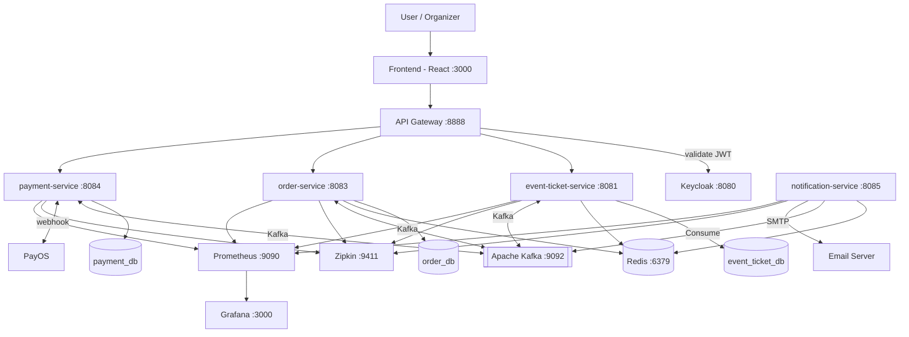

# 🏗️ Kiến trúc Hệ thống

## 1. Tổng quan

Hệ thống **Event Ticketing** là nền tảng đặt vé sự kiện trực tuyến được xây dựng theo kiến trúc Microservices. Hệ thống giải quyết bài toán quản lý và bán vé sự kiện theo thời gian thực, đảm bảo không xảy ra tình trạng oversell ngay cả khi có hàng trăm người dùng đặt vé đồng thời.

**Người dùng mục tiêu:**
- **Guest** — duyệt danh sách sự kiện
- **User** — đăng nhập, đặt vé, thanh toán
- **Organizer** — tạo và quản lý sự kiện

**Các thuộc tính chất lượng chính:**
- **Reliability** — Outbox Pattern + idempotency consumer đảm bảo không mất message và không xử lý trùng lặp
- **Consistency** — Redis Lua script đảm bảo atomic inventory lock, tránh oversell
- **Scalability** — mỗi service scale độc lập theo nhu cầu
- **Availability** — Redis Sentinel, Kafka 3 broker, không có single point of failure

---

## 2. Architecture Style

Các pattern và style kiến trúc được áp dụng:

- [x] Microservices
- [x] API Gateway pattern
- [x] Event-driven / Message queue (Apache Kafka)
- [x] Database per service
- [x] Saga pattern (Choreography)
- [x] Outbox pattern
- [x] Idempotent consumer

---

## 3. Các thành phần hệ thống

| Thành phần | Trách nhiệm | Tech Stack | Port |
|-----------|------------|------------|------|
| **Frontend** | Giao diện người dùng — duyệt sự kiện, đặt vé, thanh toán | React | 3000 |
| **Keycloak** | Auth server — đăng ký, đăng nhập, phát hành JWT, quản lý role | Keycloak | 8080 |
| **API Gateway** | Single entry point — validate JWT, routing, rate limiting | Spring Cloud Gateway | 8888 |
| **event-ticket-service** | CRUD sự kiện, quản lý loại vé, khóa inventory | Spring Boot, PostgreSQL, Redis | 8081 |
| **order-service** | Lifecycle đơn hàng, Saga choreography, ghost reservation | Spring Boot, PostgreSQL, Redis (Redisson) | 8083 |
| **payment-service** | Tích hợp PayOS, xử lý callback, hoàn tiền tự động | Spring Boot, PostgreSQL | 8084 |
| **notification-service** | Tạo QR code, gửi email xác nhận | Spring Boot, Redis | 8085 |
| **Apache Kafka** | Async messaging giữa các service | Kafka (3 brokers) | 9092 |
| **Redis** | Inventory lock, rate limiting, Redisson Delayed Queue | Redis + Sentinel | 6379 |
| **PostgreSQL** | Persistent storage — mỗi business service có DB riêng | PostgreSQL | 5432 |
| **Prometheus** | Thu thập metrics từ tất cả service | Prometheus | 9090 |
| **Grafana** | Dashboard + cảnh báo theo ngưỡng latency | Grafana | 3000 |
| **Zipkin** | Distributed tracing xuyên suốt Kafka chain | Zipkin | 9411 |

---

## 4. Communication Patterns

### Giao tiếp đồng bộ (Synchronous)

- **REST API** giữa Frontend và API Gateway
- **API Gateway → Service**: Gateway xác thực, sau đó **chuyển tiếp nguyên vẹn JWT (Token Relay)** xuống Backend.
- Các business service tự kiểm tra JWT, lấy user profile (`email`, `userId`) và **không gọi REST lẫn nhau** trong luồng chính — tránh tight coupling.

### Giao tiếp bất đồng bộ (Asynchronous)

- **Apache Kafka** cho toàn bộ giao tiếp giữa các business service
- Tất cả producer dùng **Outbox Pattern** — không publish Kafka trực tiếp trong DB transaction
- Mọi consumer đều **idempotent** — dùng bảng `processed_events` với `ON CONFLICT DO NOTHING`

| Kafka Topic | Producer | Consumer | Mục đích |
|-------------|----------|----------|---------|
| `ticket.reserved` | event-ticket-service | order-service | Inventory lock thành công → tạo order |
| `ticket.release` | order-service | event-ticket-service | Hủy order → nhả vé về inventory |
| `order.created` | order-service | payment-service | Kích hoạt luồng thanh toán |
| `payment.completed` | payment-service | order-service | Thông báo thanh toán thành công/thất bại cho order xử lý |
| `order.confirmed` | order-service | notification-service | Xác nhận đơn + gửi thẻ vé điện tử |
| `refund.requested` | payment-service | order-service | Thông báo yêu cầu hoàn tiền cho khách hàng |
| `refund.completed` | order-service | payment-service | Thông báo hoàn tiền thành công |

### Service Discovery

- **Docker Compose internal DNS** — các service gọi nhau qua hostname (ví dụ: `event-ticket-service:8081`)
- Không dùng Eureka — Docker DNS đủ dùng cho môi trường hiện tại, tránh thêm complexity không cần thiết

### Inter-service Communication Matrix

| From → To | event-ticket | order | payment | notification | Gateway | Kafka |
|-----------|-------------|-------|---------|-------------|---------|-------|
| **Frontend** | | | | | REST | |
| **API Gateway** | REST | REST | REST | | | |
| **event-ticket-service** | | | | | | Produce/Consume |
| **order-service** | | | | | | Produce/Consume |
| **payment-service** | | | | | | Produce/Consume |
| **notification-service** | | | | | | Consume |

---

## 5. Data Flow

### Luồng tạo sự kiện (UC1)

```
Organizer → Frontend → API Gateway [validate JWT, relay JWT]
  → event-ticket-service [Parse JWT role=ORGANIZER] → PostgreSQL (event_ticket_db)
                         → Redis (seed inventory keys)
```

### Luồng đặt vé (UC2 — Happy Path)

```
User → Frontend → API Gateway [validate JWT, relay JWT]
  → event-ticket-service [Parse JWT, extract email, Redis Lua lock → PostgreSQL]
    → Kafka: ticket.reserved (kèm email)
      → order-service [PostgreSQL lưu Order kèm email + Redisson 10min timer]
        → Kafka: order.created
          → payment-service [PayOS URL]
            ← PayOS callback
            → Kafka: payment.completed
              → order-service [Cập nhật CONFIRMED, trích xuất email từ DB]
                → Kafka: order.confirmed
                  → notification-service [Sinh QR + Gửi Email]
```

### Luồng compensation (UC2 — Exception)

```
[E1 - Payment failed]
PayOS callback (fail) → payment-service → Kafka: payment.failed
  → order-service [CANCELLED] → Kafka: ticket.release
    → event-ticket-service [Redis INCRBY, Booking CANCELLED]

[E2 - Order timeout]
Redisson (sau 10 phút) → order-service [CANCELLED] → Kafka: ticket.release
  → event-ticket-service [Redis INCRBY, Booking CANCELLED]

[E3 - Refund]
order-service [CANCELLED] consume payment.completed [SUCCESS] → Kafka: refund.requested
  → payment-service [REFUNDED] -> Kafka: refund.completed
    -> order-service [REFUNDED]
```

---

## 6. Architecture Diagram



> 📌 Xem file ảnh chi tiết tại: [`docs/asset/architecture-diagram.png`](asset/architecture-diagram.png)

---

## 7. Triển khai

- Tất cả service được đóng gói bằng **Docker**
- Điều phối toàn bộ hệ thống qua **Docker Compose** — bao gồm cả infrastructure (Kafka, Redis, PostgreSQL, Keycloak, Zipkin, Prometheus, Grafana)
- Khởi động toàn bộ hệ thống bằng một lệnh duy nhất:

```bash
docker compose up --build
```

**Thứ tự khởi động (dependency order trong Docker Compose):**

```
PostgreSQL, Redis, Kafka, Keycloak
  → event-ticket-service, order-service, payment-service, notification-service
    → API Gateway
      → Frontend
```

**Port reference:**

| Service / Infra | Port |
|----------------|------|
| Frontend (React) | 3000 |
| Keycloak | 8080 |
| API Gateway | 8888 |
| event-ticket-service | 8081 |
| order-service | 8083 |
| payment-service | 8084 |
| notification-service | 8085 |
| Kafka | 9092 |
| Redis | 6379 |
| Zipkin | 9411 |
| Prometheus | 9090 |
| Grafana | 3000 |

---

## 8. Scalability & Fault Tolerance

### Scale độc lập từng service

Mỗi service có DB riêng và không chia sẻ state — có thể scale horizontal độc lập:

| Service | Khi nào cần scale | Cách scale |
|---------|------------------|-----------|
| event-ticket-service | Sự kiện hot, nhiều người xem/đặt vé | Tăng replica, Redis Lua đảm bảo không race condition |
| order-service | Lượng đơn hàng tăng đột biến | Tăng replica, ShedLock đảm bảo OutboxPoller chỉ chạy 1 instance |
| payment-service | Nhiều callback PayOS đồng thời | Tăng replica, idempotency table tránh xử lý trùng |
| notification-service | Lượng email tăng | Tăng consumer instance, Kafka tự phân phối partition |

### Xử lý khi service bị sập

| Tình huống | Cơ chế bảo vệ | Recovery |
|-----------|--------------|---------|
| Redis node sập | Redis Sentinel 3 node — tự động failover | ~30s failover, hoạt động bình thường |
| Kafka broker sập | 3 broker, replication factor=3, min ISR=2 | Message vẫn available ở broker khác |
| Service crash sau DB commit, trước Kafka publish | Outbox Pattern — message nằm trong DB, retry khi recover | OutboxPoller publish lại khi service restart |
| Kafka consumer crash trước commit offset | Idempotency consumer — `processed_events` với `ON CONFLICT DO NOTHING` | Kafka re-deliver, consumer bỏ qua duplicate |
| Redis sập khi có Redisson Delayed Queue | Safety net `@Scheduled` mỗi 15 phút quét DB | Worst case: hủy order trễ tối đa 15 phút |
| PayOS callback nhiều lần | Kiểm tra orderId để check trạng thái | |
| ShedLock holder crash | `lockAtMostFor` timeout tự expire | Sau 4s, instance khác acquire lock |

### Retry & Dead Letter Topic

- Consumer retry **3 lần** với backoff `1s → 2s → 4s` trước khi từ bỏ
- Message thất bại sau 3 lần retry được đẩy sang **Dead Letter Topic** (`.DLT`) để xử lý thủ công
- Consumer chính không bị block bởi message lỗi

### Tính nhất quán dữ liệu

- **Inventory**: Redis Lua script đảm bảo atomic check-and-decrement — không bao giờ oversell
- **Distributed transaction**: Saga Choreography qua Kafka — eventual consistency, không dùng 2PC
- **Compensation**: mọi bước compensation đều idempotent — an toàn khi retry nhiều lần
