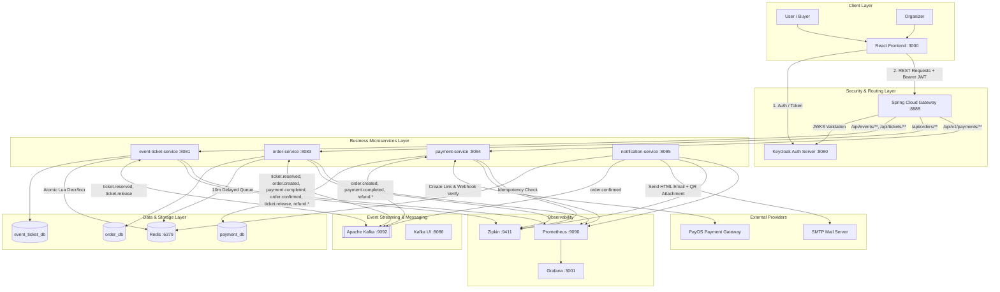
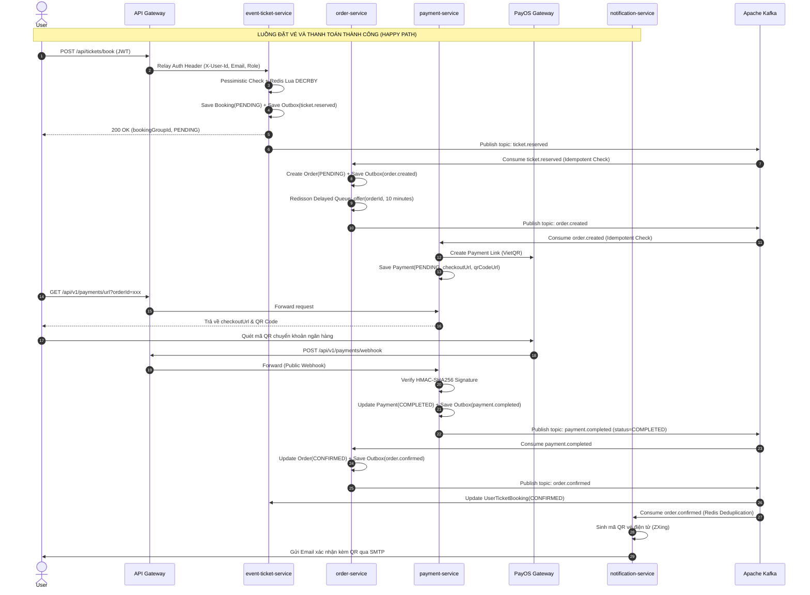
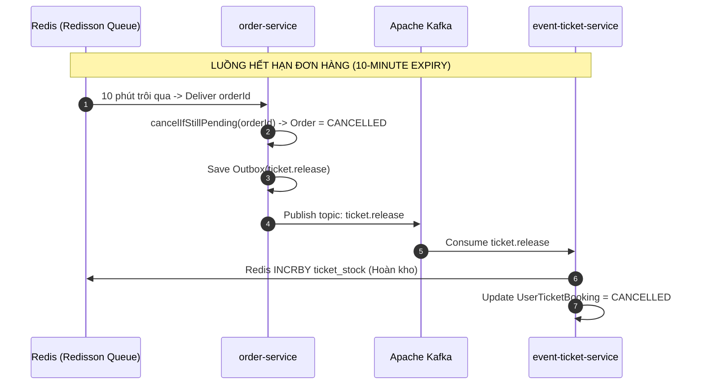
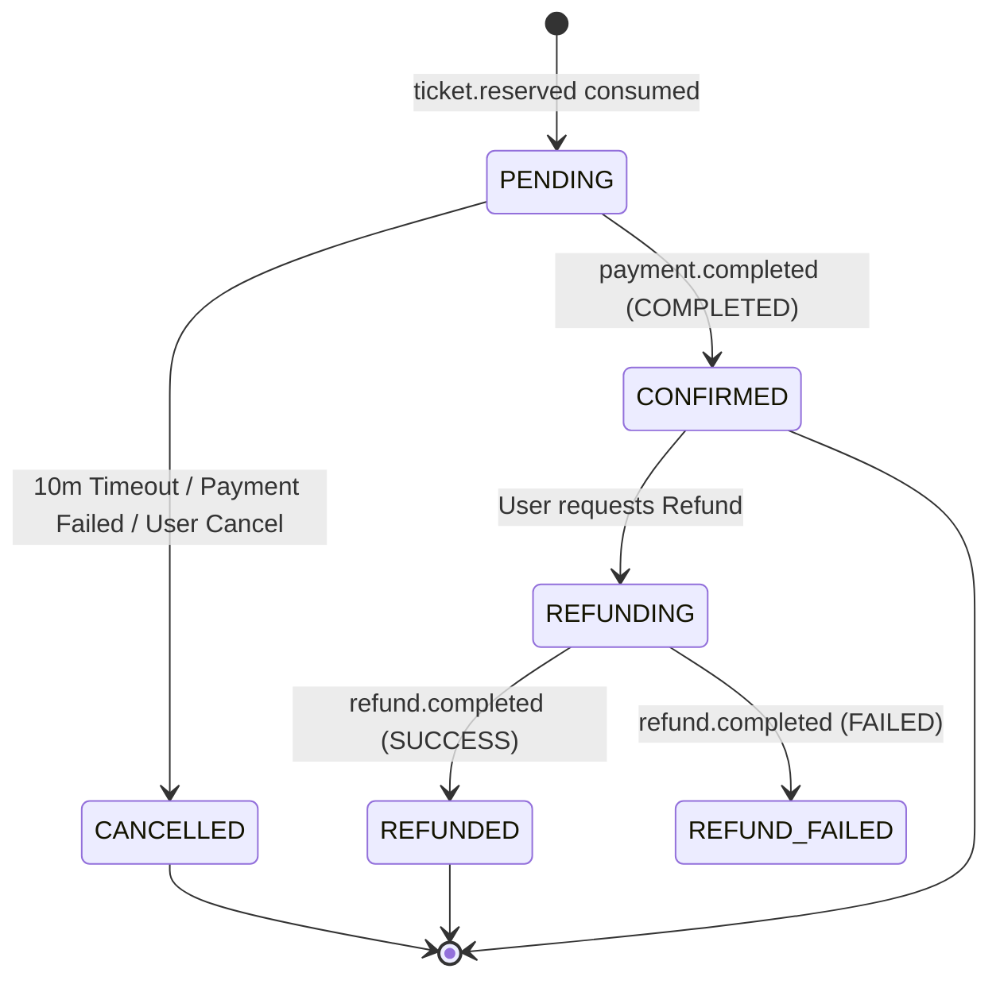
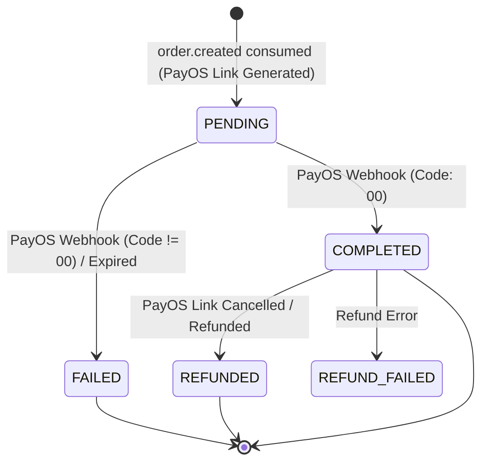
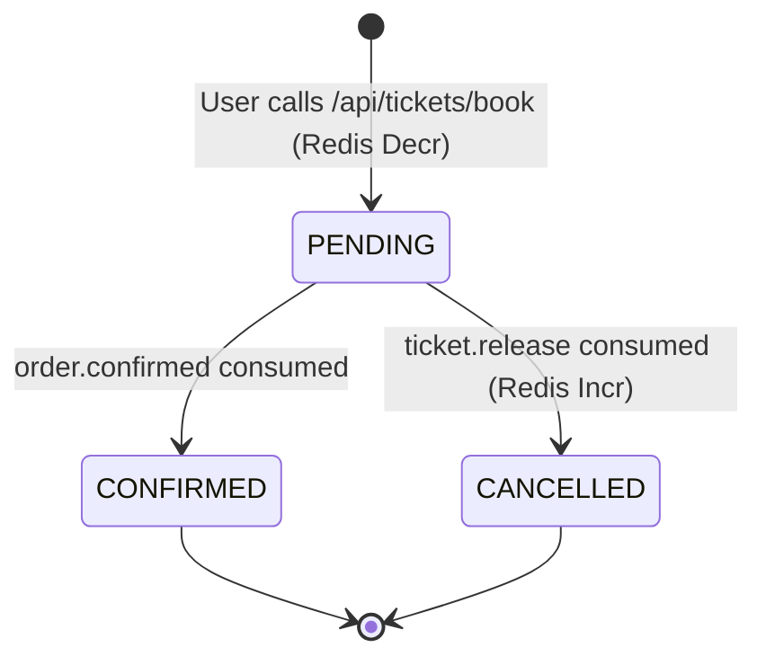
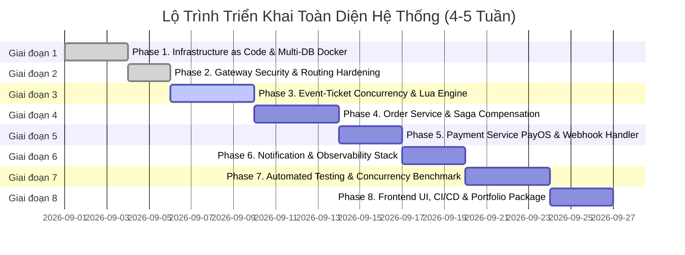

# 📋 Kế Hoạch Triển Khai Hệ Thống Đặt Vé Sự Kiện Phân Tán (Event Ticketing System)

> **Mục tiêu dự án:** Xây dựng hệ thống Microservices quy mô chuẩn Enterprise cho đồ án / Portfolio CV, thể hiện năng lực thiết kế hệ thống phân tán chịu tải cao (High Concurrency), xử lý giao dịch phân tán (Distributed Saga Choreography), kiểm soát tồn kho chống Overselling (Atomic Redis Lua), giải quyết bài toán Ghost Reservation, tích hợp cổng thanh toán thực tế (PayOS Sandbox), và đảm bảo tính quan sát toàn diện (Observability).

---

## 1. 🎯 Tổng quan Hệ thống & Ma trận Kỹ thuật

### 1.1. Bảng kỹ thuật áp dụng & Mục đích Showcase

| Bài toán kỹ thuật thực tế | Kỹ thuật áp dụng | Mục đích Showcase trên CV / Review |
|---|---|---|
| **Chống Overselling vé khi nghìn người cùng đặt** | Atomic Redis Lua script + DB Pessimistic Locking (`SELECT FOR UPDATE`) | Concurrency control, Race condition handling, In-memory speed |
| **Giao dịch phân tán (Đặt vé $\rightarrow$ Order $\rightarrow$ PayOS $\rightarrow$ Email)** | **Saga Choreography** qua Apache Kafka (KRaft mode) | Distributed transactions, Event-driven architecture, Eventual consistency |
| **Hủy đơn / Hết hạn / Lỗi thanh toán $\rightarrow$ Hoàn vé** | Saga Compensating Transactions + Idempotent Rollback | Resilience, Error handling & Self-healing trong hệ phân tán |
| **Giữ chỗ ảo (Ghost Reservation) & Hết hạn đơn 10 phút** | **Redisson Distributed Delayed Queue** + Safety Net `@Scheduled` | Distributed scheduler, Time-based event triggers |
| **Không mất message khi Service hoặc DB bị sập** | **Transactional Outbox Pattern** + ShedLock / Exponential Backoff | At-least-once delivery, Dual-write prevention |
| **Chống xử lý trùng lặp message (Double-processing)** | **Idempotent Consumers** (`processed_events` table + Redis `SETNX`) | Kafka at-least-once deduplication, Safe retries |
| **Xử lý message lỗi không làm nghẽn hàng đợi** | **Dead Letter Topic (.DLT)** + Consumer Retry with Backoff | Fault isolation, Poison pill handling |
| **Thanh toán trực tuyến thực tế** | **PayOS SDK v2 (VietQR)** + Webhook Cryptographic Verification | Payment gateway integration, Secure webhook handling |
| **Vé điện tử & Thông báo tức thời** | ZXing QR Code generator + Thymeleaf HTML Mail + Spring Mail | Async background tasks, Dynamic templating |
| **Bảo mật phân tán & Xác thực tập trung** | **Keycloak OIDC (OAuth2/JWT)** + Spring Cloud Gateway Token Relay | Zero-Trust architecture, Role-based Access Control (RBAC) |
| **Chống Spam & DoS tại Gateway** | Redis Token Bucket Rate Limiter (3 orders/phút/user, IP fallback) | API Gateway rate limiting, Traffic shaping |
| **Truy vết lỗi xuyên suốt chuỗi Microservices** | **Distributed Tracing (Micrometer + Brave + Zipkin)** | Tracing context propagation qua HTTP & Kafka Headers |
| **Giám sát hiệu năng & Cảnh báo** | Spring Boot Actuator + Prometheus + Grafana | Production metrics, Observability & Monitoring |
| **Triển khai toàn bộ hệ thống "Một chạm"** | Multi-container **Docker Compose** (Apps + Postgres multi-DB + Keycloak + Kafka + Redis + Observability) | DevOps, Infrastructure as Code (IaC) |

---

### 1.2. Tech Stack Chuẩn Hóa Toàn Hệ Thống

- **Ngôn ngữ & Nền tảng:** Java 21 (Virtual Threads), Spring Boot 3.5.x, Spring Cloud 2025.x
- **API Gateway:** Spring Cloud Gateway (WebFlux / Reactive), Spring Security OAuth2 Resource Server
- **Identity & Access Management (IAM):** Keycloak 24+ (OpenID Connect, PKCE, JWT Tokens)
- **Message Broker:** Apache Kafka 3.7.0 (KRaft mode - không cần ZooKeeper), Kafka UI
- **In-Memory Cache & Distributed Lock:** Redis 7 (Alpine), Redisson 3.52+, ShedLock 7.5+
- **Cơ sở dữ liệu:** PostgreSQL 16 (Database-per-Service: `event_ticket_db`, `order_db`, `payment_db`)
- **Cổng thanh toán:** PayOS Java SDK 2.0.1 (Tạo link thanh toán VietQR động, xác thực chữ ký Webhook HMAC-SHA256)
- **Notification & Template:** Thymeleaf Template Engine, ZXing 3.5.3 (QR Code Generation), JavaMailSender (SMTP)
- **Observability:** Micrometer Tracing, Brave Tracing Bridge, Zipkin 3.x, Prometheus, Grafana
- **Testing:** JUnit 5, Mockito, Testcontainers (PostgreSQL, Kafka, Redis), k6 / JMeter (Concurrency & Load Test)

---

### 1.3. Service Inventory & Phân bổ Mạng / Cổng

| Tên Service | Port | Database / Storage | Trách nhiệm chính |
|---|---|---|---|
| **Frontend (React)** | `3000` | LocalStorage / State | Giao diện duyệt sự kiện, chọn vé, hiển thị QR PayOS và lịch sử đơn |
| **Keycloak Auth** | `8080` | PostgreSQL (h2/internal) | Identity Provider: Đăng ký, đăng nhập, phát hành JWT (`USER`, `ORGANIZER`) |
| **API Gateway** | `8888` | Redis (`rate_limit`) | Single Entrypoint, validate JWT, inject headers (`X-User-*`), Redis Rate Limiting |
| **event-ticket-service** | `8081` | PostgreSQL (`event_ticket_db`), Redis (`ticket_stock`) | CRUD Event, cấu hình Ticket Types, khóa kho vé atomic bằng Redis Lua, Outbox |
| **order-service** | `8083` | PostgreSQL (`order_db`), Redis (Redisson Delay Queue) | Quản lý vòng đời Order, Saga Choreography, hẹn giờ hủy 10 phút, Outbox, Deduplication |
| **payment-service** | `8084` | PostgreSQL (`payment_db`) | Tích hợp PayOS SDK, tạo QR VietQR, nhận Webhook callback, Outbox retry, Refund |
| **notification-service** | `8085` | Redis (Idempotency Cache) | Sinh QR Code vé điện tử, render Thymeleaf HTML, gửi email xác nhận qua SMTP |
| **Apache Kafka** | `9092` | Kafka Log Volume | Message Broker KRaft kết nối sự kiện giữa các services (Internal: `kafka:29092`) |
| **Kafka UI** | `8086` | — | Dashboard trực quan giám sát Topics, Consumers, Message Payloads |
| **Redis** | `6379` | In-Memory | Quản lý tồn kho vé (`ticket_stock`), Rate Limit token bucket, Redisson Delayed Queue |
| **PostgreSQL** | `5432` | Data Volume | Lưu trữ dữ liệu quan hệ cho các microservices |
| **Zipkin** | `9411` | In-Memory / Storage | Distributed Tracing Dashboard |
| **Prometheus** | `9090` | Time-series DB | Thu thập metrics từ `/actuator/prometheus` của các services |
| **Grafana** | `3001` | Sqlite/Data | Dashboard trực quan hóa Latency, Throughput, Error rate, JVM stats |

---

## 2. 🏗️ Kiến Trúc Hệ Thống & Các Pattern Phân Tán

### 2.1. Sơ đồ Kiến trúc Tổng thể (Architecture Diagram)



---

### 2.2. Chi tiết Các Pattern Phân Tán Cốt Lõi

#### Pattern 1: Concurrency Control 2 Lớp (Chống Overselling)
Để đảm bảo không bao giờ bán vượt số lượng vé (kể cả khi 10,000 requests cùng ập đến trong 1 giây):
1. **Lớp 1 - Database Level (Pessimistic Lock):** Kiểm tra giới hạn số vé tối đa mỗi user được mua (`maxTicketsPerUser`). Sử dụng `SELECT FOR UPDATE` trên bảng `user_ticket_booking` để khóa dòng dữ liệu của user trong suốt transaction.
2. **Lớp 2 - In-Memory Level (Atomic Redis Lua Script):** Thực thi lệnh trừ kho vé nguyên tử trên Redis:
   ```lua
   -- KEYS[1]: ticket_stock key (e.g., "ticket_stock:uuid")
   -- ARGV[1]: initial DB stock (nếu key chưa có trên Redis)
   -- ARGV[2]: quantity to decrement
   local stock = redis.call('GET', KEYS[1])
   if stock == false then
       local dbStock = tonumber(ARGV[1])
       redis.call('SET', KEYS[1], dbStock, 'NX')
       stock = dbStock
   else
       stock = tonumber(stock)
   end
   local quantity = tonumber(ARGV[2])
   if stock < quantity then
       return -1 -- SOLD OUT hoặc không đủ số lượng
   end
   return redis.call('DECRBY', KEYS[1], quantity)
   ```
3. **Rollback an toàn:** Nếu việc ghi DB hoặc Outbox thất bại, transaction DB rollback và code lập tức gọi `redisTemplate.opsForValue().increment(key, quantity)` để hoàn lại kho vé chính xác cho những loại vé đã trừ.

---

#### Pattern 2: Distributed Saga Choreography & State Management
Hệ thống không sử dụng giao dịch 2 pha (2PC) mà dùng mô hình **Saga Choreography** qua Kafka Topics:



---

#### Pattern 3: Ghost Reservation & 10-Minute Timeout Handling
Nếu khách hàng đặt vé nhưng không thanh toán trong 10 phút, hệ thống tự động giải phóng vé:
1. Khi `order-service` tạo đơn `PENDING`, ID đơn hàng được đẩy vào **Redisson Delayed Queue** với timeout 10 phút:
   ```java
   orderDelayedQueue.offer(order.getId().toString(), 10, TimeUnit.MINUTES);
   ```
2. Một Virtual Thread trong `OrderExpiryConsumer` liên tục gọi `take()` từ `RBlockingQueue`. Khi 10 phút trôi qua, `orderId` tự động trồi lên:
   - Kiểm tra DB: Nếu đơn vẫn đang `PENDING` $\rightarrow$ Chuyển thành `CANCELLED`.
   - Ghi Outbox event `ticket.release` đẩy vào Kafka.
3. `event-ticket-service` consume `ticket.release`:
   - Thực thi `INCRBY` trên Redis cho từng loại vé trong đơn.
   - Cập nhật `UserTicketBooking` sang `CANCELLED`.
4. **Safety Net Scheduler:** Bổ sung `@Scheduled(fixedDelay = 900_000)` (mỗi 15 phút) quét DB tìm các đơn `PENDING` tạo trước 12 phút để phòng trường hợp Redis node khởi động lại làm mất in-flight timer.



---

#### Pattern 4: Transactional Outbox Pattern & At-Least-Once Delivery
Để loại bỏ bài toán **Dual-Write Problem** (ghi DB thành công nhưng publish Kafka thất bại hoặc ngược lại):
1. Mọi sự kiện phát sinh đều được lưu trực tiếp vào bảng `outbox` trong **cùng một DB Transaction** với nghiệp vụ chính.
2. Một background poller (`OutboxPoller` / `OutboxEventScheduler`) quét các bản ghi `PENDING` theo lô (Batch 50-100 items).
3. Sử dụng **ShedLock** (`@SchedulerLock`) để đảm bảo trong cụm nhiều instance chỉ có đúng 1 instance thực hiện polling tại một thời điểm.
4. Khi gửi Kafka thành công $\rightarrow$ Đánh dấu `SENT`. Nếu thất bại $\rightarrow$ Tính toán `next_retry_at` với **Exponential Backoff**. Nếu vượt quá `max_retry` (vd: 5 lần) $\rightarrow$ Đánh dấu `DEAD` và đẩy cảnh báo.

```
┌────────────────────────────────────────────────────────┐
│                   SERVICE INSTANCE                     │
│                                                        │
│   [ Business Service ] ──(1. Local DB Transaction)──┐  │
│                                                     ▼  │
│                          ┌───────────────────────────┐ │
│                          │ PostgreSQL                │ │
│                          │  ├── business_tables      │ │
│                          │  └── outbox (PENDING)     │ │
│                          └─────────────┬─────────────┘ │
│                                        │ (2. Poll)     │
│                                        ▼               │
│                            [ Outbox Scheduler ]        │
│                           (ShedLock Distributed)       │
│                                        │               │
└────────────────────────────────────────┼───────────────┘
                                         │ (3. Send message)
                                         ▼
                               ┌───────────────────┐
                               │   Apache Kafka    │
                               └───────────────────┘
```

---

#### Pattern 5: Idempotent Consumer & Deduplication Strategy
Để phòng tránh việc Kafka re-deliver message hoặc PayOS gửi webhook nhiều lần:
1. **Tại `order-service` & `event-ticket-service`:**
   - Sử dụng bảng `processed_events (idempotency_key UUID PK, processed_at TIMESTAMP)`.
   - Consumer thực hiện atomic insert:
     ```sql
     INSERT INTO processed_events (idempotency_key, processed_at)
     VALUES (:key, NOW())
     ON CONFLICT (idempotency_key) DO NOTHING;
     ```
   - Nếu số dòng affected = 0 $\rightarrow$ Message đã được xử lý $\rightarrow$ Bỏ qua an toàn.
2. **Tại `notification-service` (Stateless Service):**
   - Sử dụng Redis cache `SET notif:processed:{idempotencyKey} 1 NX EX 86400` (TTL 24h).
   - Nếu `setIfAbsent` trả về `false` $\rightarrow$ Message trùng lặp $\rightarrow$ Skip.

---

## 3. 📡 Ma Trận Sự Kiện Kafka & Chuẩn Hóa Data Contracts

Mọi message trong hệ thống bắt buộc phải tuân thủ chuẩn JSON payload dưới đây để đảm bảo tính đồng bộ tuyệt đối giữa các dịch vụ:

### 3.1. Danh mục Kafka Topics

| Topic | Producer | Consumer(s) | Key | Mục đích |
|---|---|---|---|---|
| `ticket.reserved` | event-ticket-service | order-service | `idempotencyKey` | Đặt vé thành công trên Redis/DB $\rightarrow$ Kích hoạt tạo Order |
| `order.created` | order-service | payment-service | `orderId` | Order được tạo PENDING $\rightarrow$ Kích hoạt tạo link PayOS |
| `payment.completed` | payment-service | order-service | `orderId` | PayOS Webhook trả kết quả $\rightarrow$ Cập nhật đơn hàng |
| `payment.failed` | payment-service | order-service | `orderId` | Thanh toán thất bại $\rightarrow$ Hủy đơn hàng |
| `order.confirmed` | order-service | event-ticket-service, notification-service | `orderId` | Đơn thanh toán thành công $\rightarrow$ Chốt vé & gửi Email QR |
| `ticket.release` | order-service | event-ticket-service | `bookingGroupId` | Đơn bị hủy / hết hạn $\rightarrow$ Hoàn kho vé trên Redis |
| `refund.requested` | order-service | payment-service | `orderId` | Yêu cầu hủy đơn đã trả tiền $\rightarrow$ Hoàn tiền PayOS |
| `refund.completed` | payment-service | order-service | `orderId` | Hoàn tiền xong $\rightarrow$ Chuyển đơn sang REFUNDED |

---

### 3.2. Chi tiết Payload Schemas (Data Contracts)

#### 1. Topic: `ticket.reserved`
```json
{
  "bookingGroupId": "a1b2c3d4-e5f6-7890-abcd-ef1234567890",
  "userId": "123e4567-e89b-12d3-a456-426614174000",
  "email": "user@example.com",
  "eventId": "b2c3d4e5-f6a7-8901-bcde-f12345678901",
  "totalPrice": 1500000,
  "idempotencyKey": "c3d4e5f6-a7b8-9012-cdef-123456789012",
  "items": [
    {
      "ticketTypeId": "d4e5f6a7-b8c9-0123-def1-234567890123",
      "ticketTypeName": "VIP",
      "quantity": 2,
      "price": 500000
    },
    {
      "ticketTypeId": "e5f6a7b8-c9d0-1234-ef12-345678901234",
      "ticketTypeName": "Standard",
      "quantity": 1,
      "price": 500000
    }
  ]
}
```

#### 2. Topic: `order.created` (Gửi sang Payment Service)
```json
{
  "orderId": "f6a7b8c9-d0e1-2345-f123-456789012345",
  "userId": "123e4567-e89b-12d3-a456-426614174000",
  "eventId": "b2c3d4e5-f6a7-8901-bcde-f12345678901",
  "amount": 1500000,
  "description": "Thanh toan ve su kien",
  "idempotencyKey": "c3d4e5f6-a7b8-9012-cdef-123456789012",
  "requestedAt": "2026-08-27T15:30:00",
  "items": [
    {
      "name": "VIP",
      "quantity": 2,
      "price": 500000
    },
    {
      "name": "Standard",
      "quantity": 1,
      "price": 500000
    }
  ]
}
```

#### 3. Topic: `payment.completed`
```json
{
  "eventId": "b2c3d4e5-f6a7-8901-bcde-f12345678901",
  "orderId": "f6a7b8c9-d0e1-2345-f123-456789012345",
  "paymentId": "78901234-5678-90ab-cdef-1234567890ab",
  "status": "COMPLETED",
  "reason": null,
  "processedAt": "2026-08-27T15:32:00"
}
```

#### 4. Topic: `order.confirmed` (Gửi Notification & Event Ticket)
```json
{
  "orderId": "f6a7b8c9-d0e1-2345-f123-456789012345",
  "bookingGroupId": "a1b2c3d4-e5f6-7890-abcd-ef1234567890",
  "email": "user@example.com",
  "eventId": "b2c3d4e5-f6a7-8901-bcde-f12345678901",
  "totalPrice": 1500000,
  "items": [
    {
      "ticketTypeName": "VIP",
      "quantity": 2,
      "price": 500000
    },
    {
      "ticketTypeName": "Standard",
      "quantity": 1,
      "price": 500000
    }
  ]
}
```

#### 5. Topic: `ticket.release`
```json
{
  "bookingGroupId": "a1b2c3d4-e5f6-7890-abcd-ef1234567890",
  "bookingIdempotencyKey": "c3d4e5f6-a7b8-9012-cdef-123456789012",
  "items": [
    {
      "ticketTypeId": "d4e5f6a7-b8c9-0123-def1-234567890123",
      "quantity": 2
    },
    {
      "ticketTypeId": "e5f6a7b8-c9d0-1234-ef12-345678901234",
      "quantity": 1
    }
  ]
}
```

---

## 4. 🔄 State Machines & Vòng Đời Thực Thể

### 4.1. Order State Machine (`order-service`)



### 4.2. Payment State Machine (`payment-service`)



### 4.3. UserTicketBooking State Machine (`event-ticket-service`)



---

## 5. 🛠️ Danh Mục Fix Lỗi & Tái Cấu Trúc Mã Nguồn (Refactoring Guide)

### 5.1. Sửa Lỗi Chí Mạng Database Schema tại `payment-service`
- **File:** `services/payment-service/src/main/resources/V1__init_schema.sql` và `Payment.java`
- **Nguyên nhân lỗi:** Khóa `UNIQUE` trên `event_id` khiến không thể tạo thanh toán thứ 2 cho cùng 1 sự kiện; khóa `UNIQUE` và `NOT NULL` trên `payload VARCHAR(255)` làm vỡ DB khi dữ liệu null hoặc dài hơn 255 ký tự.
- **Giải pháp:**
  ```sql
  -- SỬA THÀNH:
  CREATE TABLE payments (
      id uuid PRIMARY KEY,
      order_id character varying(255) NOT NULL UNIQUE,
      user_id character varying(255) NOT NULL,
      event_id character varying(255) NOT NULL, -- XÓA UNIQUE
      amount bigint NOT NULL,
      status character varying(50),
      payos_order_code bigint UNIQUE,
      qr_code_url character varying(1000),
      checkout_url character varying(1000),
      idempotency_key character varying(255) NOT NULL UNIQUE,
      payload text,                             -- ĐỔI SANG TEXT VÀ XÓA UNIQUE
      created_at timestamp without time zone,
      updated_at timestamp without time zone,
      expired_at timestamp without time zone
  );
  ```

### 5.2. Đồng bộ Data Contract giữa `order-service` và `payment-service`
- **File:** `services/payment-service/src/main/java/com/hdv/payment_service/dtos/request/OrderItemDto.java`
- **Giải pháp:** Sử dụng `@JsonProperty` hoặc đổi trường `name` thành `ticketTypeName` (hoặc chấp nhận cả hai qua setter/alias) để tránh `item.getName() == null` khi PayOS SDK validate.

### 5.3. Bổ sung `PaymentController` và Gateway Routing
- **File cần thêm:** `services/payment-service/src/main/java/com/hdv/payment_service/controller/PaymentController.java`
- **Endpoints:**
  - `GET /api/v1/payments/url?orderId={orderId}`: Trả về `checkoutUrl`, `qrCodeUrl`, `status`.
  - `GET /api/v1/payments/{orderId}`: Lấy chi tiết trạng thái thanh toán.
- **Gateway Route:** Thêm route `/api/v1/payments/**` vào `gateway/src/main/resources/application.yaml` và mở `permitAll()` cho `/api/v1/payments/webhook` trong `GatewayConfig.java`.

### 5.4. Sửa Fallback Stock trong `event-ticket-service` khi Cache Cold
- **File:** `services/event-ticket-service/src/main/java/com/hdv/event_ticket_service/ticket/service/InventoryService.java`
- **Giải pháp:** Khi gọi Lua script, nếu cần fallback khởi tạo, truyền số lượng thực tế từ `TicketTypeRepository.findById()` thay vì hardcode `"0"` làm hệ thống hiểu nhầm là Sold Out.

### 5.5. Cập nhật `UserTicketBooking` sang `CONFIRMED`
- **File cần thêm:** `OrderConfirmedConsumer.java` trong `event-ticket-service`.
- **Logic:** Lắng nghe topic `order.confirmed`, tìm các booking theo `bookingGroupId`, cập nhật `status = BookingStatus.CONFIRMED`.

---

## 6. 🚀 Lộ Trình Triển Khai Chi Tiết (8 Giai Đoạn)



### Phase 1: Infrastructure as Code & Full Standalone Docker Compose (2-3 ngày)
- [x] Thiết lập Kafka KRaft mode (port 9092) + Kafka UI (port 8086).
- [x] Cấu hình Redis 7 (port 6379) cho cache, rate limit và Redisson.
- [ ] Bổ sung container PostgreSQL 16 (port 5432) vào `docker-compose.yml` kèm script `scripts/init-databases.sql` tự động tạo 3 cơ sở dữ liệu: `event_ticket_db`, `order_db`, `payment_db`.
- [ ] Bổ sung container Keycloak 24+ (port 8080) vào Docker Compose với file import realm cấu hình sẵn client `event-ticketing-client` và 2 tài khoản mẫu (`organizer`, `john_doe`).
- [ ] Tích hợp Zipkin (port 9411), Prometheus (port 9090), Grafana (port 3001).

### Phase 2: API Gateway & Security Hardening (2 ngày)
- [ ] Cấu hình Token Relay Filter chuyển tiếp JWT nguyên vẹn xuống các backend services.
- [ ] Thêm logic chống **Header Spoofing**: Tự động xóa các header `X-User-Id`, `X-User-Email`, `X-User-Role` do client gửi lên trước khi inject thông tin từ JWT đã verify.
- [ ] Bổ sung routing tới `payment-service` (`/api/v1/payments/**`).
- [ ] Mở quyền `permitAll()` cho endpoint Webhook của PayOS: `/api/v1/payments/webhook`.
- [ ] Sửa `RateLimiterConfig`: Fallback sang IP address (`exchange.getRequest().getRemoteAddress()`) đối với request chưa đăng nhập.

### Phase 3: Event Ticket Service Fixes & Concurrency Engine (3-4 ngày)
- [ ] Sửa lỗi fallback tồn kho của Lua script trong `InventoryService.java`.
- [ ] Thêm Role Check `@PreAuthorize("hasRole('ORGANIZER')")` hoặc kiểm tra header `X-User-Role = ORGANIZER` cho API tạo sự kiện.
- [ ] Bổ sung API `PUT /api/events/{id}/publish` để chuyển trạng thái từ `DRAFT` sang `PUBLISHED`.
- [ ] Thêm kiểm tra điều kiện chỉ cho phép đặt vé khi sự kiện ở trạng thái `PUBLISHED`.
- [ ] Thêm `OrderConfirmedConsumer.java` cập nhật `UserTicketBooking` sang `CONFIRMED`.
- [ ] Viết Outbox Poller với ShedLock đảm bảo không publish trùng lặp.

### Phase 4: Order Service & Saga Compensation Engine (3-4 ngày)
- [ ] Mở rộng enum `OrderStatus`: `PENDING`, `CONFIRMED`, `CANCELLED`, `REFUNDING`, `REFUNDED`, `REFUND_FAILED`.
- [ ] Bổ sung trường `checkoutUrl` và `qrCodeUrl` vào `OrderResponse` (hoặc cung cấp endpoint liên kết).
- [ ] Hoàn thiện luồng hủy đơn & hoàn tiền (UC2-E3): Khi User gọi `/api/orders/{id}/cancel` trên đơn đã `CONFIRMED`, chuyển sang `REFUNDING` và bắn `refund.requested` sang Kafka.
- [ ] Thêm consumer cho topic `refund.completed`: Cập nhật đơn thành `REFUNDED` hoặc `REFUND_FAILED`.
- [ ] Đảm bảo bảng `shedlock` và `processed_events` được khởi tạo tự động trong DB.

### Phase 5: Payment Service PayOS Integration & Webhook Handler (3-4 ngày)
- [ ] Sửa file DDL `V1__init_schema.sql` và entity `Payment.java` (loại bỏ `UNIQUE` trên `event_id`, sửa kiểu dữ liệu `payload`).
- [ ] Sửa `generateOrderCode()` sang cơ chế an toàn hơn (tránh trùng lặp `payos_order_code`).
- [ ] Tạo `PaymentController.java` cung cấp API lấy link thanh toán và xem trạng thái theo `orderId`.
- [ ] Tạo file tài liệu OpenAPI `docs/api-specs/payment-service.yaml`.
- [ ] Hoàn thiện `RefundService.java` xử lý event `refund.requested` từ `order-service`.

### Phase 6: Notification Service & Observability Stack (2-3 ngày)
- [ ] Tinh chỉnh Thymeleaf template `ticket-confirmation.html` hiển thị bảng chi tiết các loại vé, tổng tiền, mã đơn và mã QR vé điện tử đính kèm.
- [ ] Bổ sung cấu hình Retry với Backoff và Dead Letter Topic (`order.confirmed.DLT`) khi gửi mail thất bại.
- [ ] Kiểm tra việc truyền `traceparent` (Trace ID / Span ID) xuyên suốt từ Gateway $\rightarrow$ Service $\rightarrow$ Kafka Header $\rightarrow$ Downstream Consumer trên giao diện Zipkin.
- [ ] Xây dựng Grafana Dashboard giám sát: Request Rate (RPS), P95/P99 Latency, Kafka Consumer Lag, Redis Hit/Miss ratio.

### Phase 7: Automated Testing Suite & Concurrency Validation (3-4 ngày)
- [ ] Viết Integration Test với **Testcontainers** (khởi động PostgreSQL và Kafka container thật để test trọn vẹn luồng Saga).
- [ ] Viết Concurrency Test (`ConcurrencyBookingTest.java`) dùng `ExecutorService` 100 threads cùng tranh mua 10 vé cuối cùng $\rightarrow$ Assert đúng 10 vé được bán, không có oversell, tồn kho Redis = 0.
- [ ] Viết k6 script mô phỏng 500 Virtual Users đặt vé đồng thời.
- [ ] Test kịch bản Ghost Reservation: Đặt vé xong bỏ thanh toán, chờ 10 phút, assert Order chuyển `CANCELLED` và kho vé Redis tự động hồi phục.

### Phase 8: Frontend Demo Client, CI/CD & Portfolio Showcase (2-3 ngày)
- [ ] Hoàn thiện giao diện React Frontend: Đăng nhập Keycloak OIDC, danh sách sự kiện, form chọn số lượng nhiều loại vé, modal quét mã QR VietQR PayOS kèm polling kiểm tra trạng thái thanh toán.
- [ ] Thiết lập GitHub Actions CI Pipeline: Build tất cả service Gradle, chạy JUnit test, build Docker images.
- [ ] Hoàn thiện file `README.md` chính: Đính kèm Architecture Diagram, Sequence Diagram, bảng API Endpoint, GIF/Video demo, và hướng dẫn chạy 1 lệnh `docker compose up --build`.

---

## 7. 🧪 Kịch Bản Kiểm Thử Chịu Tải & Chứng Minh Concurrency

### 7.1. Mã Test Concurrency Mẫu (Java JUnit 5 + ExecutorService)

```java
@Test
void testConcurrentBooking_PreventOverselling() throws InterruptedException {
    int numberOfThreads = 100;
    int availableStock = 10;
    UUID eventId = createdEventId;
    UUID ticketTypeId = createdTicketTypeId;

    // Set stock ban đầu = 10
    redisTemplate.opsForValue().set("ticket_stock:" + ticketTypeId, String.valueOf(availableStock));

    ExecutorService executor = Executors.newFixedThreadPool(numberOfThreads);
    CountDownLatch startLatch = new CountDownLatch(1);
    CountDownLatch endLatch = new CountDownLatch(numberOfThreads);

    AtomicInteger successCount = new AtomicInteger(0);
    AtomicInteger failedCount = new AtomicInteger(0);

    for (int i = 0; i < numberOfThreads; i++) {
        UUID userId = UUID.randomUUID();
        executor.submit(() -> {
            try {
                startLatch.await(); // Tất cả thread bắn cùng 1 tích tắc
                BookTicketRequest request = new BookTicketRequest(eventId, List.of(
                    new BookTicketRequest.BookTicketItemRequest(ticketTypeId, 1)
                ));
                ticketBookingService.bookTicket(userId, "user@test.com", request);
                successCount.incrementAndGet();
            } catch (Exception e) {
                failedCount.incrementAndGet();
            } finally {
                endLatch.countDown();
            }
        });
    }

    startLatch.countDown(); // Phát lệnh bắn
    endLatch.await(30, TimeUnit.SECONDS);

    // KẾT QUẢ KỲ VỌNG TUYỆT ĐỐI:
    assertEquals(availableStock, successCount.get(), "Chỉ đúng 10 đơn đặt thành công");
    assertEquals(numberOfThreads - availableStock, failedCount.get(), "90 đơn còn lại phải bị từ chối");
    assertEquals("0", redisTemplate.opsForValue().get("ticket_stock:" + ticketTypeId), "Kho Redis còn lại đúng 0");
}
```

---

## 8. 📝 Checklist Review Portfolio & Giới Hạn Dự Án (Known Limitations)

### 8.1. Checklist "Điểm Cộng Lớn" Khi Phỏng Vấn / Review CV
- [ ] **Architecture Clarity**: Có sơ đồ kiến trúc tổng thể và Sequence Diagram chi tiết cho luồng Happy Path và 3 luồng đền bù (Compensating transactions).
- [ ] **Real Concurrency Proof**: Có log / test report chứng minh hệ thống không bị Race Condition và không bao giờ Oversell dưới tải cao.
- [ ] **Zero-Data-Loss Outbox**: Chứng minh được kể cả khi tắt ngang Kafka hoặc Service trong lúc User đang đặt vé, dữ liệu vẫn không mất và được gửi lại khi service sống lại.
- [ ] **Idempotent Everything**: Mọi consumer đều chịu được việc nhận cùng 1 message 10 lần mà DB vẫn nhất quán.
- [ ] **One-Touch Deployment**: Toàn bộ hệ sinh thái khởi động trơn tru chỉ với `docker compose up --build`.

### 8.2. Giới Hạn Đã Biết & Hướng Phát Triển Tương Lai (Known Limitations)
> *Trình bày phần này trong README thể hiện tư duy kỹ sư thực tế, hiểu rõ ranh giới giữa hệ thống Demo/Prototype và Production Enterprise triệu người dùng.*

1. **PayOS VietQR Refund Limit:** PayOS là cổng thu hộ chuyển khoản VietQR, API sandbox hiện chỉ hỗ trợ hủy link thanh toán chưa trả (`cancelPaymentLink`). Việc tự động hoàn tiền trực tiếp vào tài khoản ngân hàng của khách đòi hỏi tích hợp thêm API Chi hộ (Payout API) của ngân hàng đối tác.
2. **Kafka Partition Ordering:** Hiện tại các topic đang để partition mặc định. Trong môi trường scale lớn, cần partition theo `eventId` để đảm bảo thứ tự tuyệt đối của các sự kiện trên cùng một sự kiện.
3. **Redis Single Node vs Redis Sentinel/Cluster:** Docker Compose hiện chạy 1 node Redis để tối ưu tài nguyên máy dev. Trong môi trường Production thực tế, hệ thống sẽ chuyển sang cụm **Redis Sentinel** (3 node failover) hoặc **Redis Cluster** chia sharding.
